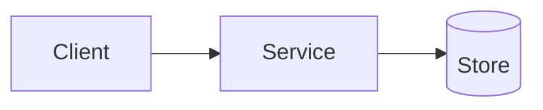

# Template: Architecture Overview

## Purpose

What capability, subsystem, or architectural area does this document cover?

## Goals

- TBD

## Non-Goals

- TBD

## Current Context

Describe the current system state, constraints, and assumptions.

## Proposed Design

Describe the design in plain language before adding diagrams.

## Trade-Offs

| Option | Pros | Cons | Decision |
|---|---|---|---|
| TBD | TBD | TBD | TBD |

## Open Questions

- TBD
