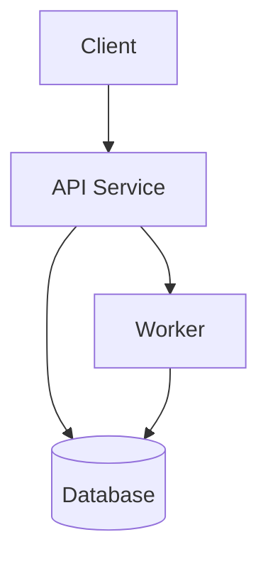

# Template: Container Diagram

## Scope

What runtime boundary does this diagram explain?

## Containers

| Container | Responsibility | Runtime | Data Owned |
|---|---|---|---|
| TBD | TBD | TBD | TBD |

## Dependencies

- TBD

## Operational Notes

- TBD
