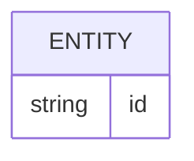

# Template: Data Model

## Entity

Describe the entity and why it exists.

## Fields

| Field | Type | Required | Notes |
|---|---|---|---|
| id | string | Yes | Stable identifier |

## Relationships

## Invariants

- TBD

## Retention

- TBD
