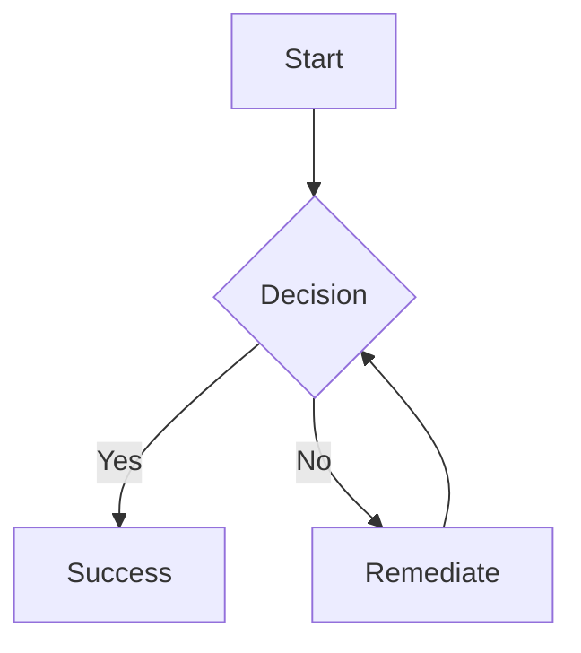

# Template: Flow Chart

## Flow

Describe the process, lifecycle, or decision tree.

```mermaid
flowchart TD
    Start["Start"] --> Decision{"Decision"}
    Decision -->|Yes| Success["Success"]
    Decision -->|No| Remediate["Remediate"]
    Remediate --> Decision
```

## States

| State | Meaning |
|---|---|
| TBD | TBD |

## Rules

- TBD
