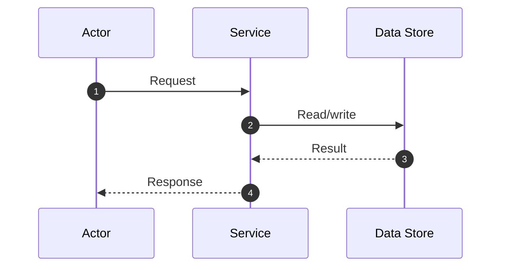

# Template: Sequence Diagram

## Scenario

Describe the user or system scenario.

## Participants

| Participant | Role |
|---|---|
| TBD | TBD |

## Sequence

## Notes

- TBD

## Failure Paths

- TBD
