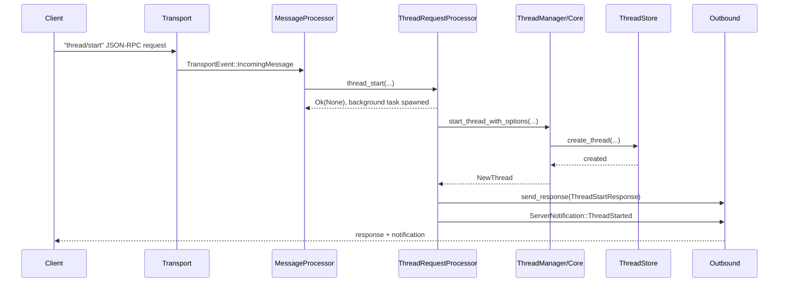
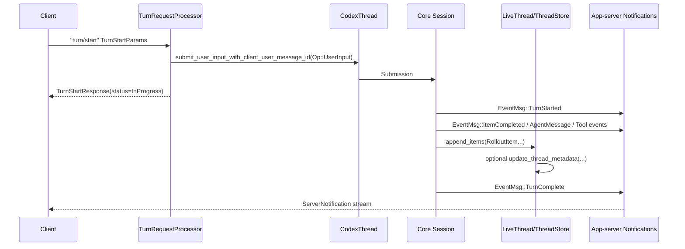
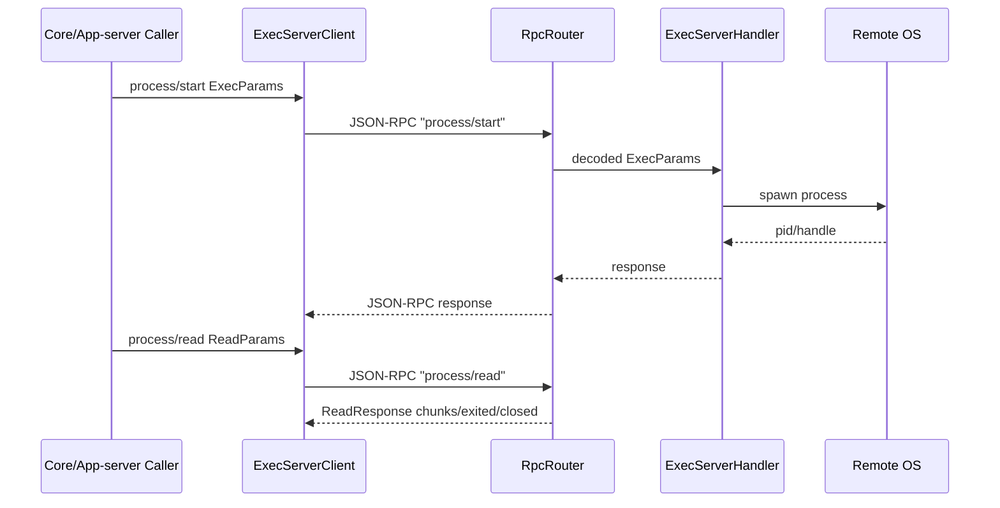
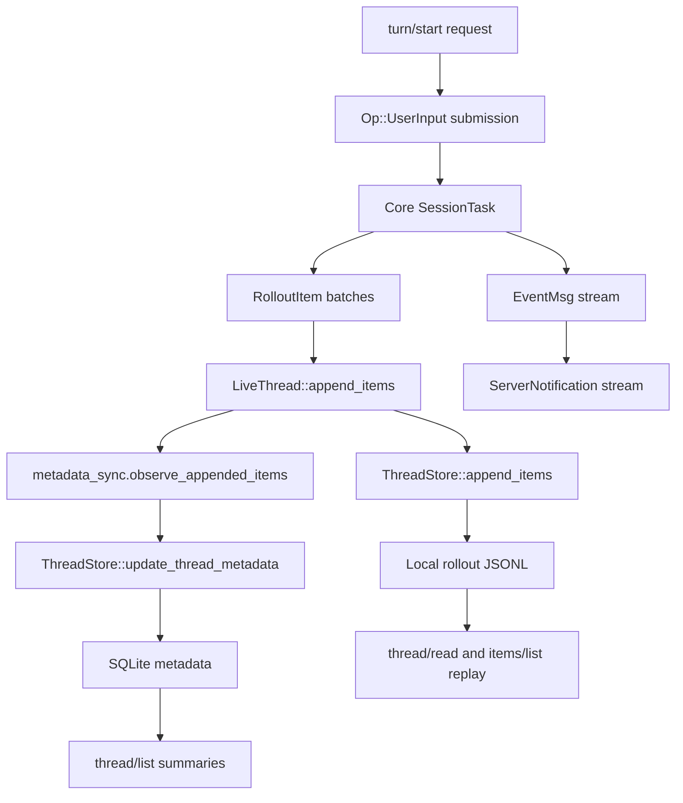

# Layer 7 - End-to-End Request Flows

This layer explains how requests move through the system from user or client
entry points to handlers, core runtime operations, storage writes, responses,
notifications, and UI-visible projections.

The goal is implementation knowledge: if you were rebuilding this system from
scratch, these are the concrete flows you would need to support.

## Source Map

Primary source files for this layer:

- `codex-rs/app-server/src/lib.rs`
  - App-server transport loop, processor loop, outbound router, incoming
    message handling, response/error/notification routing.
- `codex-rs/app-server/src/message_processor.rs`
  - `MessageProcessor::process_request`, `process_client_request`, and the
    `ClientRequest` dispatch table.
- `codex-rs/app-server/src/request_processors/thread_processor.rs`
  - `thread_start`, `thread_resume`, `thread_read`, `thread_items_list`,
    metadata/name/archive/list handlers, listener attachment, thread store
    reads, and thread started notifications.
- `codex-rs/app-server/src/request_processors/turn_processor.rs`
  - `turn_start`, `review_start`, `turn_interrupt`, core `Op` submission, and
    turn response construction.
- `codex-rs/app-server/src/request_processors/command_exec_processor.rs`
  - `command/exec`, `command/exec/write`, `command/exec/resize`, and
    `command/exec/terminate`.
- `codex-rs/app-server/src/request_processors/process_exec_processor.rs`
  - `process/spawn`, `process/writeStdin`, `process/resizePty`, and
    `process/kill`.
- `codex-rs/app-server/src/request_processors/fs_processor.rs`
  - `fs/readFile`, `fs/writeFile`, metadata, directory, remove, copy, watch,
    and unwatch handlers.
- `codex-rs/app-server/src/request_processors/mcp_processor.rs`
  - `mcpServer/oauth/login`, `mcpServerStatus/list`,
    `mcpServer/resource/read`, and `mcpServer/tool/call`.
- `codex-rs/app-server/src/request_processors/plugins.rs`
  - `plugin/list`, `plugin/installed`, `plugin/install`, plugin catalog and
    install flows.
- `codex-rs/app-server/src/request_processors/catalog_processor.rs`
  - `skills/list`.
- `codex-rs/app-server/src/request_processors/account_processor.rs`
  - `account/login`, `account/logout`, and account notifications.
- `codex-rs/app-server/src/request_processors/remote_control_processor.rs`
  - `remoteControl/*` request handlers.
- `codex-rs/app-server/src/bespoke_event_handling.rs`
  - Core `EventMsg` to app-server notification/request projections.
- `codex-rs/app-server/src/outgoing_message.rs`
  - Conversion from core/runtime events into `ServerNotification` payloads.
- `codex-rs/core/src/session/mod.rs`
  - `Session::submit`, `submit_with_trace`, and
    `submit_user_input_with_client_user_message_id`.
- `codex-rs/core/src/tasks/mod.rs`
  - `SessionTask` lifecycle and active task management.
- `codex-rs/protocol/src/protocol.rs`
  - Core `Op`, `Event`, `EventMsg`, `RolloutItem`, and `RolloutLine`.
- `codex-rs/protocol/src/models.rs`
  - Model-provider `ResponseItem` variants.
- `codex-rs/thread-store/src/store.rs`
  - `ThreadStore` trait: create, resume, append, read, list, update, archive,
    delete.
- `codex-rs/thread-store/src/live_thread.rs`
  - `LiveThread::create`, `resume`, `append_items`, and metadata sync after
    appends.
- `codex-rs/thread-store/src/local/mod.rs`
  - Local JSONL rollout plus SQLite metadata implementation.
- `codex-rs/exec-server/src/rpc.rs`
  - Exec-server RPC router and request/notification decoding.
- `codex-rs/exec-server/src/server/registry.rs`
  - Exec-server method-to-handler registration.
- `codex-rs/exec-server-protocol/src/protocol.rs`
  - Exec-server method constants and process/filesystem/http payloads.
- `sdk/typescript/src/exec.ts`
  - SDK process spawning of `codex`.
- `sdk/typescript/src/thread.ts`
  - SDK `runStreamed` flow.
- `codex-rs/exec/src/lib.rs`
  - Non-interactive `codex exec` execution and JSONL event output.

## Universal App-Server Request Shape

Most rich-client flows share this skeleton:

1. Client sends a JSON-RPC-like `JSONRPCRequest`.
   - Envelope types live in `codex-rs/app-server-protocol/src/rpc.rs`.
   - The protocol intentionally does not require a `"jsonrpc": "2.0"` field.

2. Transport receives the message.
   - `codex-rs/app-server-transport/src/transport/mod.rs` defines
     `TransportEvent::IncomingMessage`, `ConnectionOpened`, and
     `ConnectionClosed`.

3. App-server processor loop handles it.
   - `codex-rs/app-server/src/lib.rs` receives `TransportEvent::IncomingMessage`
     and calls `processor.process_request`.

4. `MessageProcessor::process_request` deserializes by method.
   - `codex-rs/app-server/src/message_processor.rs` maps the raw request to
     a typed `ClientRequest`.

5. `MessageProcessor` dispatches to a domain processor.
   - Thread methods go to `ThreadRequestProcessor`.
   - Turn/review/realtime methods go to `TurnRequestProcessor`.
   - FS methods go to `FsRequestProcessor`.
   - Command/process methods go to command/process processors.
   - MCP, account, plugin, app, config, model, feedback, and remote control
     have separate processors.

6. Handler returns one of three shapes.
   - Immediate typed response as `ClientResponsePayload`.
   - No immediate payload because the handler sends response later itself.
   - Error as `JSONRPCErrorError`.

7. Outbound route sends response/error/notification.
   - `codex-rs/app-server/src/lib.rs` uses an outbound task so slow writes do
     not block request handling.
   - `send_response`, `send_error`, and `send_server_notification` are the
     central output operations.

## Flow 1 - Rich Client Starts A New Thread

Actor and surface:

- VS Code, desktop, TUI in-process client, or any external JSON-RPC client.

Request:

- Method: `thread/start`
- Typed variant: `ClientRequest::ThreadStart`
- Payload: `ThreadStartParams`
- Response: `ThreadStartResponse`
- Notification: `thread/started` as `ThreadStartedNotification`

Concrete route:

1. The request reaches `MessageProcessor::process_request`.
2. The dispatch table calls:
   - `ThreadRequestProcessor::thread_start`
   - source: `codex-rs/app-server/src/message_processor.rs`
3. `thread_start` calls `thread_start_inner`.
4. `thread_start_inner` destructures `ThreadStartParams`:
   - model/model_provider/service_tier
   - cwd/runtime workspace roots
   - approval, reviewer, sandbox, permissions
   - config overrides
   - base/developer instructions
   - dynamic tools
   - selected capability roots
   - ephemeral/history mode
   - session/thread source
   - environments
5. It rejects invalid combinations:
   - `sandbox` and `permissions` cannot both be present.
6. It builds config overrides and environment selections.
7. It spawns a background task instead of responding inline:
   - `thread_start_inner` builds `thread_start_task`.
   - `self.background_tasks.spawn(...)` runs it.
   - The immediate handler result is `Ok(None)`.

Work done by `thread_start_task`:

1. Loads config through `ConfigManager::load_with_overrides`.
2. Persists project trust if requested/effective permissions trust the cwd.
3. Validates dynamic tools.
4. Calls `ThreadManager::start_thread_with_options`.
5. Receives a `NewThread` containing:
   - `thread_id`
   - loaded `CodexThread`
   - `session_configured`
6. Sets app-server client info on the thread.
7. Reads instruction sources and config snapshot.
8. Builds the API `Thread` projection with `build_thread_from_snapshot`.
9. Auto-attaches a conversation listener:
   - `ensure_conversation_listener`
10. Inserts the thread into `ThreadWatchManager`.
11. Builds `ThreadStartResponse`.
12. Sends the response with `send_response_with_thread_originator`.
13. Sends `ServerNotification::ThreadStarted`.

Storage/update behavior:

- Thread creation is owned below app-server by the core/thread manager and
  thread-store stack.
- `ThreadStore::create_thread` is the persistent boundary.
- Local storage uses JSONL rollout files plus SQLite metadata in
  `codex-rs/thread-store/src/local/mod.rs`.

UI surfacing:

- The client receives `ThreadStartResponse` with the initial `Thread`.
- The client also receives `ThreadStartedNotification`.
- Clients should update the thread list/sidebar and subscribe to live turn
  notifications for the new thread.

Implementation rule:

- Start-thread is asynchronous at the app-server boundary. Reimplement it as
  "request accepted, background startup task sends response/error later", not
  as a simple synchronous function call.

## Flow 2 - Rich Client Starts A Turn

Actor and surface:

- Any app-server client after a thread is loaded.

Request:

- Method: `turn/start`
- Typed variant: `ClientRequest::TurnStart`
- Payload: `TurnStartParams`
- Response: `TurnStartResponse`
- Later notifications: turn/item/thread notifications derived from core
  `EventMsg`.

Concrete route:

1. `MessageProcessor` dispatches `ClientRequest::TurnStart` to:
   - `TurnRequestProcessor::turn_start`
2. `turn_start` calls `turn_start_inner`.
3. `turn_start_inner` loads the target thread:
   - `self.load_thread(&params.thread_id)`
4. It checks direct input is allowed:
   - `ensure_direct_input_allowed`
5. It validates input size:
   - `validate_v2_input_limit`
6. It sets client info and OpenAI form elicitation support on the loaded
   `CodexThread`.
7. It resolves environment selections.
8. It maps API user input:
   - `Vec<codex_app_server_protocol::UserInput>` to
     `Vec<codex_protocol::user_input::UserInput>`
   - `V2UserInput::into_core`
9. It maps additional context and cwd/runtime overrides.
10. It builds per-turn thread settings overrides.
11. It constructs:
    - `Op::UserInput { items, final_output_json_schema,
      responsesapi_client_metadata, additional_context, thread_settings }`
12. It submits the op:
    - `CodexThread::submit_user_input_with_client_user_message_id`
13. Core creates a submission id.
    - `codex-rs/core/src/session/mod.rs`
    - `submit_user_input_with_client_user_message_id` wraps the op in
      `Submission`.
14. The submission id becomes the API `turn.id`.
15. App-server records the request-to-turn id association:
    - `outgoing.record_request_turn_id`
16. It returns:
    - `TurnStartResponse { turn: Turn { status: InProgress, items: [] } }`

Core/runtime continuation:

1. Session receives `Op::UserInput`.
2. Session starts a turn task.
   - Task orchestration lives under `codex-rs/core/src/tasks/`.
3. Core emits `Event { id, msg: EventMsg }`.
4. Event messages include:
   - `TurnStarted`
   - `UserMessage`
   - `AgentMessage`
   - `Reasoning`
   - `ItemCompleted`
   - tool calls and tool outputs
   - token usage
   - `TurnComplete`
5. App-server listener converts core events into `ServerNotification` payloads.
   - Event-specific mapping is in `bespoke_event_handling.rs` and
     `outgoing_message.rs`.

Storage/update behavior:

- During the turn, core appends durable records as `RolloutItem`.
- `LiveThread::append_items` calls:
  - `ThreadStore::append_items`
  - then `metadata_sync.observe_appended_items`
  - then possibly `ThreadStore::update_thread_metadata`
- Local implementation persists rollout JSONL and SQLite metadata.

UI surfacing:

- Immediate response shows an in-progress empty turn.
- Notifications progressively fill the UI:
  - user message item
  - assistant text/reasoning
  - command/file/tool items
  - token usage
  - terminal turn completion/error
- Read APIs can later reconstruct the same view from persisted rollout items.

Implementation rule:

- `turn/start` is synchronous only up to "submission accepted". The actual
  assistant work is streamed through notifications.

## Flow 3 - TUI In-Process Conversation

Actor and surface:

- `codex tui`, through `codex-rs/tui`.

Transport:

- TUI uses `codex-app-server-client`.
- The in-process client avoids JSON serialization for the hot path.
- `codex-rs/app-server-client/README.md` says the in-process path uses typed
  `ClientRequest`/`ClientNotification` channels and emits
  `InProcessServerEvent`.

Concrete route:

1. TUI creates an app-server session through `AppServerSession`.
2. It chooses in-process or remote client:
   - `InProcessAppServerClient`
   - `RemoteAppServerClient`
3. For local in-process operation, the client sends typed `ClientRequest`
   values.
4. App-server calls:
   - `MessageProcessor::process_client_request`
5. The same domain processors handle the request as the JSON-RPC path.
6. Responses and notifications are returned as typed in-process server events.

Storage/update behavior:

- Identical to rich-client app-server flows after the typed request reaches the
  processor.

UI surfacing:

- TUI renders the notification stream as chat messages, tool calls, approvals,
  file changes, and status changes.

Implementation rule:

- Use one handler layer for both JSON-RPC and in-process clients. Only the
  transport/envelope should differ.

## Flow 4 - Non-Interactive `codex exec`

Actor and surface:

- User or SDK runs non-interactive CLI.

Entry points:

- CLI subcommand: `exec`
- Crate: `codex-rs/exec`
- JSONL event model: `codex-rs/exec/src/exec_events.rs`
- `codex-rs/exec/src/lib.rs` states stdout must be valid JSONL in `--json`
  mode.

Request shape:

- CLI args become an exec command configuration.
- Input prompt and options become an initial operation.
- The TypeScript SDK also uses this path by spawning the `codex` binary:
  `sdk/typescript/src/exec.ts`.

Concrete route:

1. CLI parses `codex exec` arguments.
2. Exec creates or connects to an app-server client.
3. It starts/resumes a thread as needed.
4. It sends an initial user turn or review operation.
5. It consumes app-server/core events.
6. It renders either human text or JSONL event lines.

Response behavior:

- In JSON mode, stdout emits one JSON object per line.
- SDK `run()` buffers until terminal completion.
- SDK `runStreamed()` returns an async generator over intermediate events.

Storage/update behavior:

- Same thread-store path as interactive turns unless ephemeral/no-history
  options disable persistence.

UI surfacing:

- There is no live terminal UI unless the caller uses streamed JSONL.
- SDK users see structured events in their application process.

Implementation rule:

- Treat `exec` as a thin non-interactive client over the same core thread/turn
  machinery, with a different event renderer.

## Flow 5 - Review Start

Actor and surface:

- CLI `codex review`
- app-server client using `review/start`

Request:

- Method: `review/start`
- Typed variant: `ClientRequest::ReviewStart`
- Payload: `ReviewStartParams`
- Response: `ReviewStartResponse`

Concrete route:

1. `MessageProcessor` dispatches to:
   - `TurnRequestProcessor::review_start`
2. `review_start_inner` destructures:
   - `thread_id`
   - `target`
   - `delivery`
3. It loads the parent thread.
4. It converts `ReviewTarget` into a core review request and display text.
5. It chooses delivery:
   - inline review
   - detached review
6. Inline delivery submits work to the parent thread.
7. Detached delivery starts or uses a separate review thread, sends
   `ThreadStarted` for it when needed, and submits the review op.
8. `emit_review_started` sends `ReviewStartResponse`.

Storage/update behavior:

- Review activity is persisted through the same core rollout mechanism.
- Detached review creates/uses a separate thread identity, so thread list/read
  APIs surface it as its own thread.

UI surfacing:

- Inline review appears in the existing thread.
- Detached review appears as a separate thread and emits its own notifications.

Implementation rule:

- Review is a turn-like workflow. Implement it as a specialized operation over
  the same session/task/event/storage pipeline.

## Flow 6 - Interrupt A Running Turn

Actor and surface:

- TUI, app client, or SDK wanting to stop active work.

Request:

- Method: `turn/interrupt`
- Payload: `TurnInterruptParams`
- Response:
  - startup interrupt: immediate `TurnInterruptResponse`
  - active turn interrupt: response is delayed until abort handling resolves

Concrete route:

1. `MessageProcessor` dispatches to `TurnRequestProcessor::turn_interrupt`.
2. `turn_interrupt_inner` loads the thread.
3. If a `turn_id` is supplied, it checks the active turn snapshot in
   `ThreadState`.
4. It records pending interrupts in thread state.
5. It records request-to-turn id with outgoing.
6. It submits `Op::Interrupt` to the core thread.
7. If startup interrupt, app-server returns immediately.
8. If active turn interrupt, app-server waits for the core abort event path to
   resolve the pending request.

Storage/update behavior:

- Abort/interruption events are emitted through core and may be appended to
  rollout history depending on event type.

UI surfacing:

- Client updates active turn status to interrupted/aborted when the notification
  arrives.

Implementation rule:

- Interrupt has request correlation state. Do not model it as a stateless fire-
  and-forget signal if clients need a reliable response.

## Flow 7 - Read, List, And Page Stored Threads

Actor and surface:

- Sidebar/history UI, resume flow, SDK resume/list/read flow.

Requests:

- `thread/list`
- `thread/read`
- `thread/turns/list`
- `thread/items/list`

Concrete `thread/read` route:

1. `MessageProcessor` calls:
   - `ThreadRequestProcessor::thread_read`
2. `thread_read_response_inner` parses `ThreadReadParams`.
3. It converts `thread_id` string to `ThreadId`.
4. It calls `read_thread_view(thread_id, include_turns)`.
5. `read_thread_view` checks if the thread is loaded in `ThreadManager`.
6. If persisted state is available, it reads:
   - `ThreadStore::read_thread`
7. If the thread is loaded and `include_turns` is true, it may merge:
   - persisted metadata
   - live thread history from `loaded_thread.load_history`
8. It converts history items into API turns:
   - `build_api_turns_from_rollout_items`
9. It applies live status from `ThreadWatchManager`.
10. It returns `ThreadReadResponse { thread }`.

Concrete `thread/items/list` route:

1. `thread_items_list_response_inner` parses:
   - `thread_id`
   - `turn_id`
   - `cursor`
   - `limit`
   - `sort_direction`
2. It clamps page size.
3. It calls:
   - `ThreadStore::list_items`
4. It maps store errors into JSON-RPC errors.
5. It returns a paginated item response.

Concrete `thread/list` route:

1. `list_threads_common` applies filters:
   - model providers
   - source kinds
   - archived state
   - cwd filters
   - search term
   - relation filters
2. It pages through:
   - `ThreadStore::list_threads`
3. It returns stored thread summaries.

Storage/update behavior:

- `ThreadStore` is the read boundary.
- Local store reads both SQLite metadata and rollout JSONL history.
- Loaded thread reads can use live memory to reflect in-progress turns not yet
  fully indexed.

UI surfacing:

- `thread/list` drives sidebars and history pickers.
- `thread/read` drives a full conversation view.
- `thread/turns/list` and `thread/items/list` let clients page history without
  loading an entire large thread in one response.

Implementation rule:

- Separate "summary list", "full thread read", "turn page", and "item page".
  They have different performance and correctness requirements.

## Flow 8 - Update Thread Metadata

Actor and surface:

- User renames a thread, sets goal, changes memory mode, archives/unarchives,
  or a live append updates derived metadata.

Requests and handlers:

- `thread/name/set` -> `ThreadRequestProcessor::thread_set_name`
- `thread/metadata/update` -> `thread_metadata_update`
- `thread/goal/set` -> goal processor
- `thread/memoryMode/set` -> `thread_memory_mode_set`
- `thread/archive` and `thread/unarchive`

Concrete name update route:

1. Handler calls an inner response function.
2. It updates persistent metadata through thread-store update APIs.
3. It sends an immediate response.
4. If applicable, it sends:
   - `ServerNotification::ThreadNameUpdated`

Derived metadata route:

1. Core appends `RolloutItem` batches during a turn.
2. `LiveThread::append_items` persists the batch with:
   - `ThreadStore::append_items`
3. It filters to canonical persisted items.
4. It calls:
   - `metadata_sync.observe_appended_items`
5. If metadata changed, it calls:
   - `ThreadStore::update_thread_metadata`

Storage/update behavior:

- Explicit metadata writes go through `ThreadStore::update_thread_metadata`.
- Derived metadata writes happen after appends, not inside raw
  `ThreadStore::append_items`.
- The local store updates SQLite metadata and may repair or read rollout data
  as needed.

UI surfacing:

- Thread list and open thread headers receive notifications for visible changes.
- Later `thread/list` and `thread/read` return persisted updated metadata.

Implementation rule:

- Do not make append-only history responsible for every mutable field. Keep
  mutable metadata as a separate update path.

## Flow 9 - Filesystem Utility Requests

Actor and surface:

- Rich clients needing file contents, directory entries, file metadata, file
  writes, and change notifications.

Requests:

- `fs/readFile`
- `fs/writeFile`
- `fs/createDirectory`
- `fs/getMetadata`
- `fs/readDirectory`
- `fs/remove`
- `fs/copy`
- `fs/watch`
- `fs/unwatch`

Concrete route:

1. `MessageProcessor` dispatches FS variants to `FsRequestProcessor`.
2. `read_file` converts absolute path to `PathUri`.
3. It calls:
   - `self.file_system()?.read_file(&path, None)`
4. It returns:
   - `FsReadFileResponse { data_base64 }`
5. `write_file` decodes `data_base64`.
6. It calls:
   - `self.file_system()?.write_file(&path, bytes, None)`
7. It returns:
   - `FsWriteFileResponse {}`

Watch route:

1. `fs/watch` verifies a file-system backend is configured.
2. It delegates to `FsWatchManager::watch`.
3. Watch registrations are scoped by connection id and client-supplied
   `watch_id`.
4. Changes emit:
   - `ServerNotification::FsChanged`
5. `fs/unwatch` removes the connection-scoped watch.
6. Connection close cleanup removes only that connection's watches.

Storage/update behavior:

- FS utility requests affect the host filesystem, not thread-store, unless
  later surfaced as model-visible file change items through a turn.

UI surfacing:

- File explorer/editor panels consume direct responses.
- Watch notifications update editor state or file tree badges.

Implementation rule:

- Base64 is used for file bytes on the JSON boundary. Keep binary file payloads
  out of raw JSON strings.

## Flow 10 - One-Off Command Execution

Actor and surface:

- Rich client asks app-server to run a utility command outside a model turn.

Request:

- Method: `command/exec`
- Payload: `CommandExecParams`
- Notifications:
  - `CommandExecOutputDeltaNotification`
  - completion/terminal command notifications from command manager

Concrete route:

1. `MessageProcessor` dispatches to:
   - `CommandExecRequestProcessor::one_off_command_exec`
2. It requires a local environment:
   - `require_local_environment`
3. It validates:
   - non-empty command
   - `permissionProfile` cannot combine with `sandboxPolicy`
   - terminal size requires `tty: true`
   - output cap and timeout option combinations
4. It resolves cwd, env, sandbox, permission profile, network proxy, and
   command execution request.
5. It calls:
   - `codex_core::exec::build_exec_request`
6. It starts execution with:
   - `CommandExecManager::start(StartCommandExecParams { ... })`
7. The handler returns `Ok(None)` because output/completion are sent later.

Stream/control route:

- `command/exec/write` -> `CommandExecManager::write`
- `command/exec/resize` -> `CommandExecManager::resize`
- `command/exec/terminate` -> `CommandExecManager::terminate`

Storage/update behavior:

- This is not automatically a conversation turn.
- It does not append rollout items unless another layer chooses to represent
  the command in a thread.

UI surfacing:

- Terminal widgets receive output deltas and completion state.

Implementation rule:

- Separate "utility command" from "model tool shell command". The first is
  client-owned UI infrastructure; the second is model-turn state.

## Flow 11 - Connection-Scoped Process Sessions

Actor and surface:

- Rich client wants a process-like session with a stable handle.

Requests:

- `process/spawn`
- `process/writeStdin`
- `process/resizePty`
- `process/kill`

Concrete route:

1. `MessageProcessor` dispatches to `ProcessExecRequestProcessor`.
2. `process_spawn` requires local environment.
3. It validates:
   - command must not be empty
   - `processHandle` must not be empty
   - size requires `tty: true`
4. It builds environment overrides.
5. It converts timeout options into `ExecExpiration`.
6. It calls:
   - `ProcessExecManager::start(StartProcessParams { ... })`
7. It returns no immediate payload.
8. Output and exit notifications are sent later:
   - `ProcessOutputDeltaNotification`
   - `ProcessExitedNotification`

Control route:

- `process/writeStdin` writes bytes or closes stdin.
- `process/resizePty` resizes PTY-backed processes.
- `process/kill` terminates by handle.
- Connection close cleans up that connection's process sessions.

Storage/update behavior:

- Process sessions are connection-scoped runtime state, not durable thread
  history.

UI surfacing:

- Terminal/process panels render output and exit status.

Implementation rule:

- Use client-supplied handles scoped to the connection. This prevents one
  client from accidentally controlling another client's processes.

## Flow 12 - Exec-Server Remote Process And Filesystem API

Actor and surface:

- App-server/core components needing process/filesystem/http operations in a
  separate execution environment.

Protocol:

- Crate: `codex-exec-server-protocol`
- Server: `codex-exec-server`
- Router: `RpcRouter<ExecServerHandler>`

Methods:

- Lifecycle:
  - `initialize`
  - `initialized`
  - `environment/info`
- Process:
  - `process/start`
  - `process/read`
  - `process/write`
  - `process/signal`
  - `process/terminate`
  - `process/output`
  - `process/exited`
  - `process/closed`
- Filesystem:
  - `fs/readFile`
  - `fs/open`
  - `fs/readBlock`
  - `fs/close`
  - `fs/writeFile`
  - `fs/createDirectory`
  - `fs/getMetadata`
  - `fs/canonicalize`
  - `fs/readDirectory`
  - `fs/walk`
  - `fs/remove`
  - `fs/copy`
- HTTP:
  - `http/request`
  - `http/request/bodyDelta`

Concrete route:

1. Exec-server receives a JSON-RPC request.
2. `RpcRouter::request` decodes typed params.
3. `codex-rs/exec-server/src/server/registry.rs` maps method constants to
   `ExecServerHandler` methods.
4. Handler performs process/filesystem/http operation.
5. Router serializes result or error.

Storage/update behavior:

- Exec-server owns remote runtime state such as processes and file handles.
- It does not own Codex thread history.
- Core/app-server decide whether results become rollout items.

UI surfacing:

- Usually indirect. App-server/core turn notifications surface command/tool
  results to clients.

Implementation rule:

- Keep remote execution protocol independent from the app-server user-facing
  protocol. They solve different routing problems.

## Flow 13 - MCP Tool Or Resource Request

Actor and surface:

- App-server client calling an MCP server directly.
- Core turn calling MCP tools as model-visible tools.

Requests:

- `mcpServerStatus/list`
- `mcpServer/resource/read`
- `mcpServer/tool/call`
- `mcpServer/oauth/login`

Concrete route:

1. `MessageProcessor` dispatches MCP variants to `McpRequestProcessor`.
2. `mcp_server_status_list` returns known MCP server status.
3. `mcp_resource_read` calls the MCP connection/resource layer and may send
   response asynchronously.
4. `mcp_server_tool_call` invokes a named MCP tool through the MCP connection
   manager.
5. OAuth login starts browser/token work and sends:
   - `McpServerOauthLoginCompletedNotification`

Storage/update behavior:

- Direct MCP API calls do not automatically mutate thread history.
- MCP calls inside a model turn become tool-call/tool-output rollout items
  through the core event pipeline.

UI surfacing:

- Direct app calls surface as direct responses.
- Turn-owned MCP calls surface as `ThreadItem::McpToolCall` and related item
  notifications.

Implementation rule:

- Separate direct administrative MCP APIs from model-turn MCP tool execution.

## Flow 14 - Plugin, Skill, And App Catalog Requests

Actor and surface:

- Rich clients rendering installable plugins, installed plugins, skills, and
  apps/connectors.

Requests:

- `skills/list`
- `plugin/list`
- `plugin/installed`
- `plugin/install`
- `marketplace/add`, `marketplace/remove`, `marketplace/upgrade`
- `app/list`

Concrete route:

1. `skills/list` dispatches to `CatalogRequestProcessor::skills_list`.
2. It reads skill roots and returns configured/available skills.
3. `plugin/list` dispatches to `PluginRequestProcessor::plugin_list`.
4. `plugin_list_response` evaluates requested marketplace kinds:
   - local
   - vertical
   - shared with me
   - created by me remote
   - workspace directory
5. It may start background plugin list tasks for config.
6. `plugin/install` dispatches to `plugin_install_response`.
7. Install can perform local or remote marketplace installation.
8. If plugin MCP servers require auth, install starts MCP OAuth login flows.
9. Apps processor emits `AppListUpdated` notifications when app list content
   changes.

Storage/update behavior:

- Plugin install changes plugin/marketplace/config state, not thread rollout
  history.
- Skill and app list reads are catalog/config reads.

UI surfacing:

- Plugin marketplace views use list/install responses.
- Skill pickers use `skills/list`.
- App connector views use `app/list` and `AppListUpdated`.

Implementation rule:

- Catalog APIs are read-heavy and may need background refresh. Do not block UI
  list rendering on every remote or slow catalog source.

## Flow 15 - Account Login And Logout

Actor and surface:

- Rich client or CLI account UI.

Requests:

- `account/login`
- `account/logout`
- `account/login/cancel`
- account status/read methods

Concrete route:

1. `MessageProcessor` dispatches account variants to `AccountRequestProcessor`.
2. `login_account` starts login flow work.
3. On completion, account processor sends:
   - `ServerNotification::AccountLoginCompleted`
   - `ServerNotification::AccountUpdated`
4. `logout_account` clears account state and sends account update
   notifications.

Storage/update behavior:

- Auth/account state is stored under Codex home/login state, not thread
  rollout.

UI surfacing:

- Account menus and sign-in panels react to account notifications.
- Model/provider availability may change after auth state changes.

Implementation rule:

- Account flows are long-running and notification-oriented. They should not be
  modeled as only immediate request/response calls.

## Flow 16 - Remote Control And App-Server Daemon

Actor and surface:

- Desktop app, remote clients, or daemon lifecycle command.

Components:

- `codex app-server`
- `codex app-server daemon`
- `RemoteControlRequestProcessor`
- remote-control handle in app-server startup

Requests:

- `remoteControl/enable`
- `remoteControl/disable`
- `remoteControl/status/read`
- `remoteControl/pairing/start`
- `remoteControl/pairing/status`
- `remoteControl/pairing/cancel`

Concrete app-server route:

1. `MessageProcessor` dispatches remote-control methods to
   `RemoteControlRequestProcessor`.
2. Processor checks whether a `RemoteControlHandle` is available.
3. It calls remote-control handle operations for enabling, disabling, status,
   and pairing.
4. App-server emits:
   - `RemoteControlStatusChanged`

Daemon route:

1. User runs `codex app-server daemon ...`.
2. Daemon command starts/stops/restarts detached app-server process.
3. Daemon stores lifecycle state under:
   - `CODEX_HOME/app-server-daemon/settings.json`
   - `CODEX_HOME/app-server-daemon/app-server.pid`
   - `CODEX_HOME/app-server-daemon/app-server-updater.pid`
   - `CODEX_HOME/app-server-daemon/daemon.lock`

Storage/update behavior:

- Daemon state is pidfile/settings state.
- Remote-control status is server runtime state.
- Neither is thread rollout history.

UI surfacing:

- Remote status indicators update from `RemoteControlStatusChanged`.
- Pairing screens use pairing responses/status.

Implementation rule:

- Keep process lifecycle management outside the JSON-RPC conversation engine.
  The daemon owns starting/stopping app-server; app-server owns request routing.

## Flow 17 - SDK `runStreamed`

Actor and surface:

- TypeScript SDK consumer.

Entry point:

- `sdk/typescript/src/thread.ts`
  - `Thread.runStreamed(input, turnOptions)`
- `sdk/typescript/src/exec.ts`
  - spawns `codex`

Concrete route:

1. User calls:
   - `thread.runStreamed("...")`
2. SDK builds command args for `codex`.
3. SDK spawns the CLI process with `node:child_process.spawn`.
4. CLI runs `codex exec` in JSONL mode.
5. CLI emits structured JSONL events on stdout.
6. SDK parses JSONL lines into typed events.
7. SDK exposes an async generator:
   - `{ events } = await thread.runStreamed(...)`

Storage/update behavior:

- The CLI process still uses the normal Codex core/thread path.
- Resume support depends on persistent thread storage.

UI surfacing:

- The SDK user's application decides how to render events.

Implementation rule:

- SDK can be a process wrapper first. A direct library binding is not required
  to expose a useful streaming API.

## Flow 18 - Core Event To UI Item Projection

Actor and surface:

- Any client rendering a conversation.

Input events:

- Core emits `Event { id, msg: EventMsg }`.
- Durable history uses `RolloutItem`.
- Provider/model items use `ResponseItem`.

Projection:

1. Core event is received by an app-server listener.
2. App-server updates thread state:
   - active turn
   - item state
   - thread status
   - token usage
   - pending approvals/requests
3. App-server sends `ServerNotification` variants.
4. Clients update their local view incrementally.
5. Later read APIs reconstruct durable view from `RolloutItem` history.

Examples:

- `EventMsg::TurnStarted` starts an in-progress API `Turn`.
- `EventMsg::ItemCompleted` produces completed `ThreadItem` data.
- `ResponseItem::Message` and `ResponseItem::AgentMessage` surface assistant
  text.
- Shell/tool events surface command/tool items.
- Token events update token counters.
- `EventMsg::TurnComplete` terminates the active turn.

Storage/update behavior:

- Not every notification is durable.
- Durable conversation state comes from rollout items.
- Volatile runtime state comes from thread state/watch managers.

UI surfacing:

- Live UI uses notifications.
- Reloaded UI uses `thread/read`, `thread/turns/list`, and
  `thread/items/list`.

Implementation rule:

- Build two projections:
  - live projection from events
  - replay projection from durable history
  They must converge on the same `Thread`/`Turn`/`ThreadItem` API model.

## End-To-End Storage Flow During A Turn

The storage path is central enough to call out separately.

1. Client sends `turn/start`.
2. App-server submits `Op::UserInput`.
3. Core session starts a turn task.
4. Core emits events and builds rollout items.
5. `LiveThread::append_items` receives rollout item batches.
6. It calls `ThreadStore::append_items`.
7. Local store writes JSONL rollout data.
8. `LiveThread` runs metadata sync over canonical appended items.
9. If metadata changed, it calls `ThreadStore::update_thread_metadata`.
10. Local store updates SQLite metadata.
11. App-server notifications update current clients.
12. Future `thread/list` reads SQLite-backed summaries.
13. Future `thread/read` reconstructs thread/turn/item views from store
    history plus metadata.

## Request/Response Method And Payload Families

Use these families when designing the system from scratch:

| Family | Request methods | Primary payloads | Response/notification shape |
|---|---|---|---|
| Thread lifecycle | `thread/start`, `thread/resume`, `thread/fork`, `thread/archive`, `thread/delete` | `ThreadStartParams`, `ThreadResumeParams`, `ThreadForkParams` | `ThreadStartResponse`, `ThreadStartedNotification`, archive/delete notifications |
| Turn lifecycle | `turn/start`, `turn/interrupt`, `turn/steer` | `TurnStartParams`, `TurnInterruptParams` | `TurnStartResponse`, streamed turn/item notifications |
| Review | `review/start` | `ReviewStartParams` | `ReviewStartResponse`, normal turn/thread notifications |
| Stored history | `thread/list`, `thread/read`, `thread/turns/list`, `thread/items/list` | list/read params with cursor/limit | paginated summaries/turns/items |
| Metadata | `thread/name/set`, `thread/metadata/update`, `thread/goal/*`, `thread/settings/update` | metadata patch/set params | response plus metadata notifications |
| Filesystem | `fs/readFile`, `fs/writeFile`, `fs/watch` | path/base64/watch params | direct response plus `fs/changed` notification |
| App-server command | `command/exec`, `command/exec/write`, `command/exec/resize`, `command/exec/terminate` | `CommandExecParams` and control params | delayed output/completion notifications |
| App-server process | `process/spawn`, `process/writeStdin`, `process/resizePty`, `process/kill` | process handle params | delayed output/exit notifications |
| Exec-server | `process/start`, `process/read`, `fs/*`, `http/request` | `ExecParams`, read/write/fs/http params | exec-server JSON-RPC responses/notifications |
| MCP | `mcpServer/tool/call`, `mcpServer/resource/read`, `mcpServerStatus/list` | MCP server/tool/resource params | direct response or async completion |
| Catalog | `skills/list`, `plugin/list`, `plugin/install`, `app/list` | catalog/list/install params | list/install responses and changed notifications |
| Account | `account/login`, `account/logout` | account/login params | login/account updated notifications |
| Remote control | `remoteControl/*` | enable/status/pairing params | status/pairing responses and status notifications |
| SDK | SDK `run`, `runStreamed` | SDK input/options | JSONL event stream from `codex exec` |

## What You Need To Implement From Scratch

Build in this order:

1. Define durable conversation models.
   - Thread, turn, item, metadata, rollout line.

2. Define internal runtime protocol.
   - `Op` for commands into a session.
   - `EventMsg` for events out of a session.

3. Implement session submission.
   - Generate a submission/turn id.
   - Queue operations.
   - Run one active turn task at a time.

4. Implement append-only history.
   - JSONL or equivalent event log.
   - Append batches from core.
   - Load/replay history.

5. Implement mutable metadata store.
   - SQLite or equivalent indexed metadata table.
   - Explicit update API.
   - Derived metadata sync after appends.

6. Implement live projection.
   - Convert runtime events into UI notifications.
   - Track active turn, pending approvals, status, token usage.

7. Implement replay projection.
   - Convert stored rollout items into the same Thread/Turn/Item API models.

8. Implement app-server request envelope.
   - JSON-RPC-like request/response/error/notification.
   - Typed method enum.
   - Domain processors.

9. Implement thread and turn APIs.
   - `thread/start`, `thread/read`, `thread/list`, `turn/start`,
     `turn/interrupt`.

10. Implement utility APIs.
    - Filesystem read/write/watch.
    - Local command/process sessions.

11. Implement remote execution protocol only when needed.
    - Separate exec-server with process/filesystem/http methods.

12. Implement catalogs and auth.
    - Skills/plugins/apps.
    - MCP.
    - Account login/logout.

13. Implement clients.
    - TUI in-process client.
    - JSON-RPC rich clients.
    - `exec` JSONL CLI.
    - SDK wrapper around `exec`.

## Non-Handwavy Design Constraints

- A turn id is the core submission id for `Op::UserInput`.
- `turn/start` response means "accepted", not "completed".
- Thread start sends its response from a background task.
- App-server request routing and in-process routing share the same domain
  processors.
- Durable history and mutable metadata are separate write paths.
- Live UI state comes from notifications; reload state comes from store reads.
- Command/process utility APIs are not the same thing as model-visible shell
  tool calls.
- Exec-server is a separate internal/remote runtime protocol, not the same as
  app-server's client protocol.
- Connection-scoped resources must be cleaned up on connection close.
- Catalog/account/remote-control flows are often async and notification-driven.
