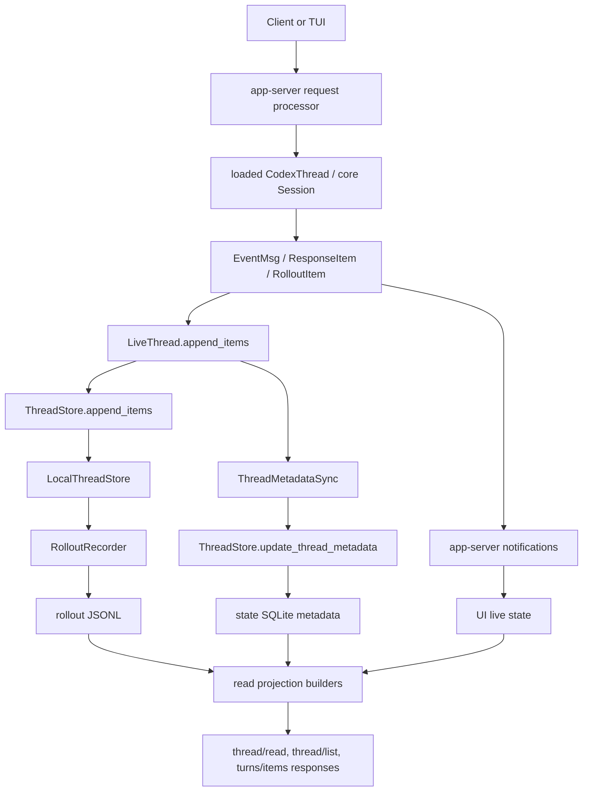

# Layer 9 - Storage and Update Paths

This layer answers:

- Where is data stored?
- Where is data updated?
- How does stored data become API/UI data?
- Which data is durable, queryable, live-only, or derived?
- What must be designed from scratch to implement the same storage behavior?

The short version: Codex does not have one storage system. It has an append-only
thread history store, a queryable SQLite metadata/index store, side stores for
config/auth/daemon/plugin/skill state, and in-memory live state that is projected
to clients through notifications.

## Source Map

Primary source files for this layer:

| Area | Source |
|---|---|
| Storage boundary | `codex-rs/thread-store/README.md` |
| Storage trait | `codex-rs/thread-store/src/store.rs` |
| Active thread write-through handle | `codex-rs/thread-store/src/live_thread.rs` |
| Local storage implementation | `codex-rs/thread-store/src/local/mod.rs` |
| Local thread creation | `codex-rs/thread-store/src/local/create_thread.rs` |
| Local live writer | `codex-rs/thread-store/src/local/live_writer.rs` |
| Rollout JSONL writer | `codex-rs/rollout/src/recorder.rs` |
| SQLite runtime | `codex-rs/state/src/runtime.rs` |
| Thread app-server processor | `codex-rs/app-server/src/request_processors/thread_processor.rs` |
| Turn app-server processor | `codex-rs/app-server/src/request_processors/turn_processor.rs` |
| Core session persistence | `codex-rs/core/src/session/session.rs` |
| Thread manager metadata routing | `codex-rs/core/src/thread_manager.rs` |
| Event-to-UI projection | `codex-rs/app-server/src/bespoke_event_handling.rs` |
| Thread status notifications | `codex-rs/app-server/src/thread_status.rs` |
| Config writes | `codex-rs/app-server/src/request_processors/config_processor.rs`, `codex-rs/core/src/config/edit.rs` |
| Auth storage | `codex-rs/login/src/auth/storage.rs` |
| Daemon state | `codex-rs/app-server-daemon/README.md`, `codex-rs/app-server-daemon/src/lib.rs`, `codex-rs/app-server-daemon/src/settings.rs` |
| Skills cache | `codex-rs/skills/src/lib.rs` |
| Plugin configuration writes | `codex-rs/config/src/plugin_edit.rs` |

## Storage Inventory

| Data | Durable Location | Owner | Update API | Read/Surface API |
|---|---|---|---|---|
| Canonical thread history | Rollout JSONL files under Codex sessions storage | `codex-rollout`, `codex-thread-store` | `ThreadStore::append_items` via `LiveThread::append_items` | `ThreadStore::load_history`, `read_thread(include_history)`, app-server `thread/read`, `thread/turns/list` |
| Thread metadata/index | SQLite state DB when available | `codex-state`, `LocalThreadStore` | `ThreadStore::update_thread_metadata` | `ThreadStore::read_thread`, `list_threads`, `search_threads` |
| Active loaded thread state | In-memory process state | `ThreadManager`, `CodexThread`, app-server thread state managers | Core event handlers and app-server listeners | Live notifications, `thread/read` fallback/merge |
| Turn/item API projection | Derived from rollout history and live event snapshots | app-server thread processor | Rebuilt on reads; live events update in-memory state | `thread/read`, `thread/turns/list`, `thread/items/list`, `item/*`, `turn/*` notifications |
| Thread status | In-memory watch state | `ThreadWatchManager` in `thread_status.rs` | load/start/turn lifecycle/status facts | `thread/statusChanged` notification and read responses |
| Config | `config.toml` and layered config files | `codex-config`, `codex-core` config edit engine | `config/value/write`, `config/batchWrite` | config read/list APIs, config reload |
| Auth credentials | `$CODEX_HOME/auth.json`, keyring, encrypted secrets file, or memory-only mode | `codex-login`, `AuthManager` | account login/logout flows | account read/notifications, auth manager |
| Daemon settings/process records | `$CODEX_HOME/app-server-daemon/settings.json`, pid files, lock files | `codex-app-server-daemon` | daemon bootstrap/start/stop/remote-control commands | daemon status/client output |
| Skills system cache | `$CODEX_HOME/skills/.system/...` plus marker | `codex-skills` | `install_system_skills` | skill loading and capability roots |
| Plugin enablement/config | `config.toml` plugin table | `codex-config`, plugin request processors | plugin/config write helpers | plugin loading, skill/MCP/app capability selection |
| Runtime logs/goals/memories | Separate SQLite DB files | `codex-state` | goal/memory/log APIs and runtime services | thread goal notifications, memory reset/read paths, logs |

## Core Storage Boundary

The storage-neutral boundary is `ThreadStore` in
`codex-rs/thread-store/src/store.rs`.

Concrete methods:

- `create_thread(params: CreateThreadParams)`
- `resume_thread(params: ResumeThreadParams)`
- `append_items(params: AppendThreadItemsParams)`
- `persist_thread(thread_id)`
- `flush_thread(thread_id)`
- `shutdown_thread(thread_id)`
- `discard_thread(thread_id)`
- `load_history(params: LoadThreadHistoryParams)`
- `read_thread(params: ReadThreadParams)`
- `read_thread_by_rollout_path(params: ReadThreadByRolloutPathParams)`
- `list_threads(params: ListThreadsParams)`
- `search_threads(params: SearchThreadsParams)`
- `list_turns(params: ListTurnsParams)`
- `list_items(params: ListItemsParams)`
- `update_thread_metadata(params: UpdateThreadMetadataParams)`
- `archive_thread(params: ArchiveThreadParams)`
- `unarchive_thread(params: ArchiveThreadParams)`
- `delete_thread(params: DeleteThreadParams)`

The important design split is explicit in `codex-rs/thread-store/README.md`:

- `append_items` is the raw canonical history append API.
- `update_thread_metadata` is the only thread metadata write API.
- `LiveThread` is the preferred active-session persistence API.
- `LocalThreadStore` writes JSONL history and SQLite query metadata.
- `RolloutRecorder` writes already-canonical items and does not decide metadata.

From-scratch implication: define a small persistence trait before implementing
local files, SQLite, remote stores, or tests. The rest of the system should not
know whether storage is local JSONL, SQLite, memory, or a service.

## Local Storage Layout

`LocalThreadStore` in `codex-rs/thread-store/src/local/mod.rs` is the local
implementation of `ThreadStore`.

It stores two different shapes:

1. Durable replay history:
   - JSONL rollout files.
   - Written by `codex-rollout::RolloutRecorder`.
   - Used for resume, fork, rollback, compaction reconstruction, and read
     projections.

2. Queryable metadata:
   - SQLite state DB when available.
   - Used for list/read/search metadata, names, archive state, git info, model
     provider, cwd, source, recency, and related indexes.

`LocalThreadStoreConfig` holds:

- `codex_home`
- `sqlite_home`
- `default_model_provider_id`

`LocalThreadStore` also holds:

- `live_recorders: HashMap<ThreadId, LiveRecorderEntry>`
- `state_db: Option<StateDbHandle>`

The `Option<StateDbHandle>` matters. The local store still supports JSONL
compatibility when SQLite is missing or when reading older rollout files.

## SQLite Runtime

`codex-rs/state/src/runtime.rs` initializes several SQLite databases under
`codex_home`:

- state DB: `STATE_DB_FILENAME`
- logs DB: `LOGS_DB_FILENAME`
- goals DB: `GOALS_DB_FILENAME`
- memories DB: `MEMORIES_DB_FILENAME`

`StateRuntime::init` creates the directory, opens pools, and runs migrators:

- `runtime_state_migrator()`
- `runtime_logs_migrator()`
- `runtime_goals_migrator()`
- `runtime_memories_migrator()`

The design reason for separate DB files is visible in the state runtime
comments: logs use a dedicated file to reduce lock contention with the rest of
state.

From-scratch implication: do not start with "one giant database." Separate:

- append-only durable history
- indexed thread metadata
- logs
- goals
- memories

## Rollout JSONL Writer

`codex-rs/rollout/src/recorder.rs` defines `RolloutRecorder`.

It writes canonical session rollout items to JSONL. The file-level comment says
rollouts are persisted as `.jsonl` so sessions can be replayed or inspected.

`RolloutRecorder` owns:

- an async command sender
- a background writer task
- a `rollout_path`

The writer command enum has:

- `AddItems(Vec<RolloutItem>)`
- `Persist`
- `Flush`
- `Shutdown`

This is a local actor-like writer. Callers send commands; the writer task owns
the file sequencing.

From-scratch implication: implement the history writer as a single-writer queue
or actor. That prevents concurrent writes from interleaving JSONL lines.

## Thread Creation Write Path

Path for a new app-server thread:

1. Client sends `thread/start`.
2. `MessageProcessor` routes `ClientRequest::ThreadStart` to
   `ThreadProcessor::thread_start`.
3. `thread_start_inner` spawns `thread_start_task`.
4. `thread_start_task` calls the core thread manager to create the session.
5. `ThreadManager::start_thread_with_options` delegates to
   `ThreadManagerState::spawn_thread_with_source`.
6. Core session initialization calls `LiveThread::create`.
7. `LiveThread::create` calls `thread_store.create_thread(params)`.
8. `LocalThreadStore::create_thread` delegates to `local::live_writer::create_thread`.
9. `local::live_writer::create_thread` delegates to
   `local::create_thread::create_thread`.
10. `local::create_thread::create_thread` builds `RolloutConfig` and creates a
    `RolloutRecorder`.
11. `LocalThreadStore` records that recorder in `live_recorders`.

Concrete source anchors:

- `ThreadProcessor::thread_start`:
  `codex-rs/app-server/src/request_processors/thread_processor.rs`
- `ThreadManager::start_thread_with_options`:
  `codex-rs/core/src/thread_manager.rs`
- `LiveThread::create`:
  `codex-rs/thread-store/src/live_thread.rs`
- `LocalThreadStore::create_thread`:
  `codex-rs/thread-store/src/local/mod.rs`
- `local::live_writer::create_thread`:
  `codex-rs/thread-store/src/local/live_writer.rs`
- `local::create_thread::create_thread`:
  `codex-rs/thread-store/src/local/create_thread.rs`
- `RolloutRecorder::new`:
  `codex-rs/rollout/src/recorder.rs`

Important payloads:

- App-server API payload: `ThreadStartParams`
- Core/session storage payload: `CreateThreadParams`
- Local writer config: `RolloutConfig`
- JSONL metadata seed: `RolloutRecorderParams::Create`

## Turn Append Write Path

Path for a user turn:

1. Client sends `turn/start`.
2. `MessageProcessor` routes `ClientRequest::TurnStart` to
   `TurnProcessor::turn_start`.
3. `TurnProcessor::turn_start_inner` validates user input and maps
   `V2UserInput` into core user input.
4. It builds `Op::UserInput`.
5. It submits the operation to the loaded core thread.
6. Core session handling emits turn lifecycle events and response items.
7. Core persistence calls `LiveThread::append_items`.
8. `LiveThread::append_items` filters to persisted/canonical rollout items.
9. It calls `thread_store.append_items(AppendThreadItemsParams { thread_id, items })`.
10. `LocalThreadStore::append_items` delegates to `local::live_writer::append_items`.
11. `local::live_writer::append_items` calls
    `RolloutRecorder::record_canonical_items`.
12. The recorder is flushed before metadata sync continues.
13. `LiveThread::append_items` asks `ThreadMetadataSync` whether the appended
    canonical items imply metadata changes.
14. If metadata changed, `LiveThread` calls
    `thread_store.update_thread_metadata(UpdateThreadMetadataParams { ... })`.

Concrete source anchors:

- `TurnProcessor::turn_start_inner` builds `Op::UserInput` in
  `codex-rs/app-server/src/request_processors/turn_processor.rs`.
- `LiveThread::append_items` is in
  `codex-rs/thread-store/src/live_thread.rs`.
- `local::live_writer::append_items` is in
  `codex-rs/thread-store/src/local/live_writer.rs`.

The ordering guarantee is explicit in `local/live_writer.rs`: the local writer
flushes after recording canonical items so SQLite never gets ahead of JSONL for
accepted live appends.

This gives the consistency model:

- JSONL history is the authoritative replay log.
- SQLite metadata is updated after accepted history appends.
- UI notifications can arrive live before a later read rebuilds from durable
  history, but accepted persisted history is flushed before derived metadata is
  applied for live appends.

## Metadata Update Paths

There are explicit user/API metadata updates and derived metadata updates.

### Explicit Updates

App-server explicit update methods include:

- `thread/setName`
- `thread/metadata/update`
- `thread/memoryMode/set`
- `thread/archive`
- `thread/unarchive`
- `thread/delete`

Concrete handlers:

- `thread_set_name_response_inner`
- `thread_metadata_update_response_inner`
- `thread_memory_mode_set_response_inner`
- `thread_archive_response`
- `thread_unarchive_response`

These live in `codex-rs/app-server/src/request_processors/thread_processor.rs`.

For loaded and cold threads, metadata is routed through
`ThreadManager::update_thread_metadata` in `codex-rs/core/src/thread_manager.rs`.
That method is important:

- If the thread is loaded, it routes through `CodexThread` and `LiveThread`.
- If the thread is not loaded, it calls `thread_store.update_thread_metadata`
  directly.
- Ephemeral loaded threads reject metadata updates.

The reason is stated in the method comment: loaded thread metadata changes must
stay ordered with live rollout writes; cold threads can go directly to the
store.

### Derived Updates

Derived metadata comes from appended history. `LiveThread::append_items` uses
`ThreadMetadataSync::observe_appended_items` and then calls
`ThreadStore::update_thread_metadata` if needed.

Examples of derived metadata include preview/recency/title-like facts that can
be observed from canonical history. The store itself does not infer those from
raw appends; the logic lives above `ThreadStore`.

From-scratch implication: keep metadata derivation outside the raw append API.
Otherwise every storage backend must duplicate business rules.

## Archive, Unarchive, Delete

Archive path:

1. `thread/archive` reaches `ThreadProcessor::thread_archive_response`.
2. The processor reads the target thread with `include_archived: false`.
3. It lists spawned descendants through `state_db_spawn_subtree_thread_ids`.
4. It calls `prepare_thread_for_archive` for loaded threads.
5. It calls `thread_store.archive_thread`.
6. Descendants are archived in reverse descendant order.

Unarchive path:

- `thread/unarchive` reaches `thread_unarchive_response`.
- It calls `thread_store.unarchive_thread`.
- It returns updated API thread metadata.

Delete path:

- `thread/delete` uses `prepare_thread_for_removal`.
- It calls `thread_store.delete_thread`.
- For local storage this removes persisted rollout data and associated metadata.

From-scratch implication: archive/delete are not only metadata flips if the
system supports spawned descendants and live loaded threads. You need lifecycle
coordination before changing persistence.

## Read Paths

### `thread/list`

`thread_list_response_inner` normalizes filters and delegates to
`list_threads_common`.

`list_threads_common` calls:

```text
thread_store.list_threads(StoreListThreadsParams { ... })
```

Important list inputs:

- `page_size`
- `cursor`
- `sort_key`
- `sort_direction`
- `allowed_sources`
- `model_providers`
- `cwd_filters`
- `archived`
- `search_term`
- `use_state_db_only`
- `relation_filter`

The store returns `ThreadPage { items, next_cursor }`.

### `thread/read`

`thread_read_response_inner` calls `read_thread_view`.

`read_thread_view` is deliberately not a simple database read:

- If the thread is loaded and `include_turns` is true:
  - it reads persisted metadata without turns
  - then uses live thread history to reconstruct turns
- If the thread is unloaded and `include_turns` is true:
  - it reads persisted metadata and history from `ThreadStore`
- If metadata-only read finds persisted metadata:
  - it uses persisted metadata
- If metadata-only read has no persisted thread but the thread is loaded:
  - it builds from the live config snapshot
- It then sets status and interrupts stale turns when needed.

Concrete functions:

- `read_thread_view`
- `load_persisted_thread_for_read`
- `load_live_thread_view`
- `apply_thread_read_store_fields`

### `thread/turns/list`

`thread_turns_list_response_inner` calls `load_thread_turns_list_history`.

Then it rebuilds turns from rollout history. The source comment says this API
still replays the entire rollout on every request because rollback and
compaction events can change earlier turns.

If the thread is loaded, it also reads the app-server `ThreadState` active turn
snapshot because persisted history may not yet include the currently running
turn.

### `thread/items/list`

`thread_items_list_response_inner` calls:

```text
thread_store.list_items(StoreListItemsParams { ... })
```

Inputs include:

- `thread_id`
- optional `turn_id`
- `include_archived`
- `cursor`
- `page_size`
- `sort_direction`

Unsupported stores return a method-not-found style app-server error for this
method.

From-scratch implication: reads are projections, not raw table dumps. You need
projection builders for thread summary, turns, turn items, active turn overlay,
and status overlay.

## UI Surfacing Paths

The app-server surfaces data to clients in two ways:

1. Direct responses to requests.
2. Notifications emitted while a loaded thread runs.

### Direct Responses

Examples:

- `thread/start` returns `ThreadStartResponse`.
- `turn/start` returns `TurnStartResponse`.
- `thread/read` returns `ThreadReadResponse`.
- `thread/list` returns a thread page response.
- `thread/turns/list` returns `ThreadTurnsListResponse`.
- `thread/items/list` returns `ThreadItemsListResponse`.
- `thread/metadata/update` returns `ThreadMetadataUpdateResponse`.

These are built in app-server request processors and returned through
`OutgoingMessageSender` as response envelopes.

### Live Notifications

`codex-rs/app-server/src/bespoke_event_handling.rs` maps core `EventMsg` values
into API notifications.

Important notification families:

- `TurnStarted`
- `TurnCompleted`
- `ItemStarted`
- `ItemCompleted`
- `RawResponseItemCompleted`
- `TurnDiffUpdated`
- `TurnPlanUpdated`
- `ThreadGoalUpdated`
- `ThreadSettingsUpdated`
- `ThreadTokenUsageUpdated`
- `AccountRateLimitsUpdated`
- error/warning/model/mcp/realtime notifications

`codex-rs/app-server/src/thread_status.rs` emits
`ServerNotification::ThreadStatusChanged` when loaded thread status changes.

How this surfaces in UI:

- Rich clients subscribe to app-server notifications.
- TUI and embedded clients can use the in-process app-server path described in
  earlier layers, but they still receive the same app-server protocol events.
- Stored reads rebuild views from rollout/SQLite; live notifications update the
  UI immediately while the turn is running.

From-scratch implication: build a notification bus separate from request
responses. Do not force clients to poll storage for every turn update.

## Config Storage

Config is not stored in the thread store.

App-server config writes go through
`codex-rs/app-server/src/request_processors/config_processor.rs`:

- `value_write`
- `batch_write`

These delegate to a config manager and optionally emit plugin toggle events or
reload user config.

The actual file persistence engine is in `codex-rs/core/src/config/edit.rs`:

- `apply_blocking(codex_home, edits)`
- `apply(codex_home, edits)`

`apply_blocking` resolves the target `config.toml`, reads/parses it, applies
structured `ConfigEdit` operations, and writes atomically through
`write_atomically`.

From-scratch implication: config writes should use structured edits against a
parsed document, not string replacement. Atomic writes prevent partial config
files.

## Auth Storage

Auth is not stored in thread history.

`codex-rs/login/src/auth/storage.rs` defines `AuthDotJson`, the expected shape
for `$CODEX_HOME/auth.json`.

Fields include:

- `auth_mode`
- `OPENAI_API_KEY`
- `tokens`
- `last_refresh`
- `agent_identity`
- `personal_access_token`
- `bedrock_api_key`

The same file also supports storage modes beyond plain file storage:

- keyring-backed storage
- encrypted local secrets file
- file fallback
- memory-only ephemeral storage

App-server account login/logout handlers live in
`codex-rs/app-server/src/request_processors/account_processor.rs` and call
login/auth manager APIs rather than thread storage APIs.

From-scratch implication: auth should be an isolated subsystem with its own
storage policy. Do not mix tokens into conversation logs.

## Daemon Storage

The app-server daemon state is not thread storage.

`codex-rs/app-server-daemon/README.md` states the daemon stores local state
under:

```text
CODEX_HOME/app-server-daemon/
```

Files:

- `settings.json`
- `app-server.pid`
- `app-server-updater.pid`
- `daemon.lock`

`codex-rs/app-server-daemon/src/lib.rs` defines the same constants:

- `PID_FILE_NAME`
- `UPDATE_PID_FILE_NAME`
- `OPERATION_LOCK_FILE_NAME`
- `SETTINGS_FILE_NAME`

`Daemon::from_environment` resolves `CODEX_HOME`, builds the state directory,
and stores paths for socket, pid files, operation lock, settings file, and the
managed Codex binary.

`codex-rs/app-server-daemon/src/settings.rs` reads/writes
`DaemonSettings` as JSON.

From-scratch implication: daemon process state belongs in a daemon-specific
state directory with pid records and locks. It should not be mixed with user
thread history.

## Skills and Plugin Storage

Skills and plugins are adjacent capability stores.

`codex-rs/skills/src/lib.rs` installs embedded system skills under the Codex
home skills directory. It writes:

- a `.system` cache directory
- a marker file containing a fingerprint

Plugin enablement/config writes are persisted through config editing. The
plugin edit helper in `codex-rs/config/src/plugin_edit.rs` writes plugin entries
into `config.toml` using atomic config writes.

Loaded plugin manifests and derived capability roots are runtime projections.
`codex-rs/plugin/src/load_outcome.rs` defines loaded plugin/capability outcome
types such as effective skill roots, MCP servers, app connectors, and hooks.

From-scratch implication: plugin files/manifests are source data; enabled
state is config data; loaded capabilities are runtime projections.

## Memory, Goals, and Logs

Memory, goals, and logs are not normal rollout items.

`StateRuntime` owns:

- `thread_goals: GoalStore`
- `memories: MemoryStore`
- log storage in a dedicated logs DB

App-server memory reset in `thread_processor.rs` calls:

- `state_db.memories().clear_memory_data()`
- `clear_memory_roots_contents(&self.config.codex_home)`

Goal and memory changes can surface through notifications. For example,
`bespoke_event_handling.rs` emits `ThreadGoalUpdated` and
`ThreadSettingsUpdated`.

From-scratch implication: long-term memory and goal state need explicit stores
and explicit reset/update APIs. They should not be recovered by scraping chat
transcripts.

## What Is Live-Only

Some state is intentionally live process state:

- loaded thread registry
- active turn status
- active turn snapshot merged into `thread/turns/list`
- pending server-to-client callbacks
- active login attempt
- running command/process handles
- file watchers
- realtime sessions
- app-server connection state

This state may be surfaced through notifications or direct API responses, but
it is not automatically durable conversation history.

From-scratch implication: document each state item as one of:

- durable history
- durable metadata/index
- durable side-store state
- live-only runtime state
- derived projection

Without that classification, persistence bugs become inevitable.

## End-to-End Storage Flow Diagram



## Request-to-Storage Mapping

| Request | Handler | Storage/State Touched | UI Surface |
|---|---|---|---|
| `thread/start` | `ThreadProcessor::thread_start` | creates live thread, opens rollout recorder, registers loaded thread state | direct response, `threadStarted` notification |
| `turn/start` | `TurnProcessor::turn_start` | appends rollout items, updates metadata, updates live state | direct response, turn/item notifications |
| `thread/read` | `ThreadProcessor::thread_read` | reads SQLite/JSONL and may merge live state | direct response |
| `thread/list` | `ThreadProcessor::thread_list` | reads thread metadata/index through `ThreadStore::list_threads` | direct response |
| `thread/turns/list` | `ThreadProcessor::thread_turns_list` | replays rollout history and may merge active live turn | direct response |
| `thread/items/list` | `ThreadProcessor::thread_items_list` | calls `ThreadStore::list_items` | direct response |
| `thread/setName` | `ThreadProcessor::thread_set_name` | `ThreadManager::update_thread_metadata` | direct response and name notification |
| `thread/metadata/update` | `ThreadProcessor::thread_metadata_update` | `ThreadManager::update_thread_metadata` | direct response with updated thread |
| `thread/memoryMode/set` | `ThreadProcessor::thread_memory_mode_set` | metadata patch through `ThreadManager` | direct response |
| `thread/archive` | `ThreadProcessor::thread_archive` | reads descendants, prepares loaded threads, archives store data | direct response |
| `thread/unarchive` | `ThreadProcessor::thread_unarchive` | unarchives store data | direct response |
| `thread/delete` | thread removal path | prepares loaded thread, deletes rollout/metadata | direct response |
| `config/value/write` | `ConfigProcessor::value_write` | edits `config.toml` through config manager/edit engine | direct response, plugin toggle events |
| `config/batchWrite` | `ConfigProcessor::batch_write` | edits `config.toml`, optional config reload | direct response, plugin toggle events |
| `account/login/start` | `AccountProcessor` | auth storage/keyring/secrets; active login state | account notifications |
| daemon commands | `codex-app-server-daemon` | settings JSON, pid files, locks | daemon command output/status |

## Consistency Model

Codex uses mixed consistency by data kind:

- Thread history is append-only and replayable.
- Local live appends flush JSONL before applying derived metadata.
- Metadata is mutable and indexed.
- Read APIs often rebuild projections from history instead of trusting cached
  turn rows.
- Live notifications are immediate runtime projections.
- Some list/read paths use SQLite indexes when present and JSONL compatibility
  fallbacks when needed.
- Ephemeral threads can exist without durable thread storage and reject some
  persisted metadata operations.

## Design Patterns in This Layer

High-level patterns:

- Storage boundary trait: `ThreadStore`
- Append-only event log: rollout JSONL
- Mutable read index: SQLite thread metadata
- Active object/write-through handle: `LiveThread`
- Background writer actor: `RolloutRecorder`
- Projection builder: rollout items to `Thread`, `Turn`, `ThreadItem`
- Live overlay: active thread snapshots/status merged into reads
- Side-store separation: config/auth/daemon/plugin/skills are not thread history

Low-level patterns:

- request payloads are converted to store parameter structs
- metadata patch structs isolate mutable fields
- one method owns each mutation path
- file writes use atomic write helpers where config is edited
- daemon process records use pid files plus locks
- unsupported store capabilities return explicit unsupported errors
- live writer maps thread IDs to recorder instances

## Build From Scratch Sequence

To implement this subsystem from scratch:

1. Define canonical history item types:
   - events
   - response items
   - session metadata
   - turn boundaries

2. Define the storage trait:
   - create/resume live thread
   - append history
   - flush/persist/shutdown/discard
   - load/read/list/search
   - list turns/items
   - update metadata
   - archive/unarchive/delete

3. Implement local append-only history:
   - JSONL format
   - one writer task per live thread
   - append, flush, shutdown commands
   - durable file path returned for local-only compatibility

4. Implement metadata/index storage:
   - SQLite state DB
   - migrations
   - thread rows
   - archive/delete state
   - recency/title/user preview/git/cwd/source/provider indexes
   - list/search pagination

5. Implement `LiveThread`:
   - owns thread ID and store handle
   - appends canonical items
   - flushes accepted history
   - derives metadata patches above the store
   - applies metadata through the same metadata update API

6. Implement thread manager metadata routing:
   - loaded threads go through live thread handles
   - cold threads go directly to the store
   - ephemeral threads reject durable metadata updates

7. Implement app-server request handlers:
   - `thread/start`
   - `turn/start`
   - `thread/read`
   - `thread/list`
   - `thread/turns/list`
   - `thread/items/list`
   - metadata/archive/delete methods

8. Implement projection builders:
   - rollout history to API thread
   - rollout history to turns
   - rollout history to items
   - active turn overlay
   - thread status overlay

9. Implement notification projection:
   - core event to app-server notification
   - status watcher
   - direct response versus async notification separation

10. Implement side stores:
    - config file edits with atomic writes
    - auth storage/keyring/secrets
    - daemon pid/settings/lock files
    - plugin enablement in config
    - skills cache
    - goals/memories/logs DBs

11. Add compatibility/fallback paths:
    - read old JSONL without SQLite
    - tolerate missing metadata rows
    - rebuild projections from replay logs
    - return explicit unsupported errors for store features not implemented

12. Add operational safety:
    - flush before metadata update
    - lock daemon operations
    - serialize conflicting app-server requests
    - atomic config writes
    - migrations and DB backup/repair for corruption

## Non-Handwavy Invariants

- `ThreadStore::append_items` appends history; it does not infer metadata.
- `ThreadStore::update_thread_metadata` is the metadata write API.
- `LiveThread` is the normal persistence API for active sessions.
- `LocalThreadStore` stores canonical replay history in JSONL and queryable
  metadata in SQLite when available.
- `local::live_writer::append_items` flushes the recorder before live metadata
  sync continues.
- `thread/read` may merge persisted metadata, live config snapshot, live
  history, and status state.
- `thread/turns/list` rebuilds turns from rollout history and merges active
  in-memory turn state for loaded running threads.
- Config writes use structured config edits and atomic persistence.
- Auth credentials are not stored in rollout history.
- Daemon state is under `CODEX_HOME/app-server-daemon`, separate from threads.
- Plugin enabled state is config state; loaded plugin capabilities are runtime
  projections.
