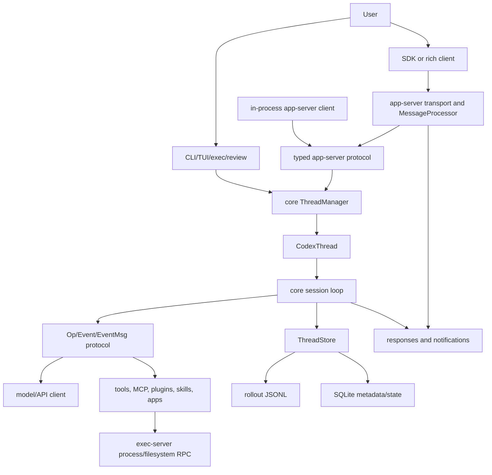

# Layer 11 - System Design Synthesis

This layer turns the lower-level evidence from Layers 1 through 10 into one
coherent system design. It answers: if you had to build a Codex-like system
from scratch, what are the major pieces, why do they exist, how do they
interact, and what order should you implement them in?

This is a synthesis layer. It does not introduce a new API catalog or a new
request-flow catalog. Those details live in:

- `07-core-data-models.md`
- `08-api-and-protocol-catalog.md`
- `09-end-to-end-request-flows.md`
- `10-routing-and-handler-mechanics.md`
- `11-storage-and-update-paths.md`

## 1. System Purpose

Codex is a local agent runtime for software engineering work. It accepts user
input from multiple surfaces, turns that input into typed operations, runs those
operations through a long-lived agent session, calls models and tools, streams
events back to clients, and persists conversation history plus queryable
metadata.

The same core runtime is reused by several product surfaces:

- terminal interactive UI
- non-interactive `exec`
- non-interactive `review`
- rich-client app-server
- app-server daemon
- exec-server
- MCP server/client integration
- plugin, skill, app, and connector systems
- SDK-style embedding

The architectural point is that these surfaces do not each implement their own
agent. They route into shared protocol, core, execution, extension, and storage
boundaries.

## 2. Main Architectural Shape

The system has five major layers:

| Layer | Role | Concrete source evidence |
|---|---|---|
| User/client surfaces | Accept user input and choose a runtime mode | `codex-rs/cli/src/main.rs`, `codex-rs/exec/src/lib.rs`, `codex-rs/app-server/src/main.rs`, `codex-rs/mcp-server/src/lib.rs` |
| Transport and API routing | Convert external messages into typed internal requests | `codex-rs/app-server/src/lib.rs`, `codex-rs/app-server/src/message_processor.rs`, `codex-rs/app-server-protocol/src/protocol/common.rs` |
| Core agent runtime | Own loaded threads, sessions, operations, tools, model calls, and event streams | `codex-rs/core/src/thread_manager.rs`, `codex-rs/core/src/codex_thread.rs`, `codex-rs/core/src/session/handlers.rs`, `codex-rs/protocol/src/protocol.rs` |
| Execution and extension adapters | Run commands, filesystem operations, MCP tools, plugins, skills, apps, and remote environments | `codex-rs/exec-server/src/server/registry.rs`, `codex-rs/exec-server/src/rpc.rs`, `codex-rs/core/src/mcp.rs`, `codex-rs/core/src/skills.rs`, `codex-rs/core/src/plugins/` |
| Persistence and projections | Store canonical history, metadata, config, auth, logs, goals, memories, and live UI projections | `codex-rs/thread-store/src/store.rs`, `codex-rs/thread-store/src/local/mod.rs`, `codex-rs/thread-store/src/live_thread.rs`, `codex-rs/rollout/src/recorder.rs`, `codex-rs/state/src/runtime.rs` |

From scratch, you should think of the system as:

1. A typed request router.
2. A per-thread agent actor/session.
3. An append-only event/history store.
4. A set of adapters for models, tools, filesystem, processes, and extensions.
5. A set of projections that turn internal events into UI-facing thread, turn,
   item, status, and notification models.

## 3. Component Diagram



The key design decision is the middle of the diagram: clients do not directly
control model calls, storage writes, or tool execution. They submit typed
requests, which become `Op` values or app-server domain operations. The core
session emits typed `EventMsg` values, which are persisted and projected back to
clients.

## 4. Major Components And Responsibilities

### 4.1 CLI Entrypoint

The CLI is the first router for terminal users. In
`codex-rs/cli/src/main.rs`, the `Subcommand` enum defines product surfaces such
as `Exec`, `Review`, `McpServer`, `AppServer`, `RemoteControl`, `Cloud`, and
`ExecServer`. The dispatch code then calls specialized crate entrypoints such
as:

- `codex_exec::run_main`
- `codex_mcp_server::run_main`
- `codex_app_server::run_main_with_transport_options`
- exec-server local or remote runners

Design lesson: keep the binary entrypoint thin. It should parse command-line
intent, select a runtime mode, and delegate to a focused library crate.

### 4.2 App-Server

`codex app-server` is the rich-client server. Its README states that it powers
rich interfaces such as the Codex VS Code extension and uses a JSON-RPC-like
wire protocol with the `"jsonrpc":"2.0"` header omitted.

Important source points:

- `codex-rs/app-server/README.md` documents transports: stdio, websocket, unix
  socket, and off.
- `codex-rs/app-server/src/lib.rs` owns transport events, processor tasks, and
  outbound routing.
- `codex-rs/app-server/src/message_processor.rs` deserializes a
  `JSONRPCRequest` into a typed `ClientRequest`.
- `codex-rs/app-server-protocol/src/protocol/common.rs` defines method names,
  request payloads, response payloads, notifications, and request serialization
  scopes.

Design lesson: app-server is not just a web server. It is a concurrency and
protocol boundary. It performs:

- connection initialization
- request deserialization
- request authorization/gating
- request serialization by resource
- domain processor dispatch
- direct responses
- live notifications
- server-to-client requests
- connection cleanup

### 4.3 App-Server Domain Processors

`MessageProcessor` delegates typed requests to domain-specific request
processors:

- `ThreadRequestProcessor`
- `TurnRequestProcessor`
- `ConfigRequestProcessor`
- `CommandExecRequestProcessor`
- `ProcessExecRequestProcessor`
- `FsRequestProcessor`
- `McpRequestProcessor`
- `PluginRequestProcessor`
- `AppsRequestProcessor`
- `AccountRequestProcessor`
- `RemoteControlRequestProcessor`
- `ThreadGoalRequestProcessor`

The source imports are visible in
`codex-rs/app-server/src/message_processor.rs`.

Design lesson: after the protocol layer has parsed a typed method, the handler
should live with the resource it mutates. This keeps `thread/start`,
`turn/start`, `fs/read`, `command/exec`, and `config/write` from becoming one
large handler.

### 4.4 Core Thread Manager

`ThreadManager` is the core owner of loaded threads. The source comment in
`codex-rs/core/src/thread_manager.rs` says it is responsible for creating
threads and maintaining them in memory.

Its state includes:

- loaded `CodexThread` instances
- auth manager
- models manager
- environment manager
- skills service
- plugins manager
- MCP manager
- code-mode session provider
- extension registry
- user instructions provider
- thread store
- optional agent graph store
- optional attestation provider
- analytics client

Design lesson: this is the composition root for agent sessions. It wires
long-lived services together and creates/resumes per-thread runtime objects.

### 4.5 CodexThread

`CodexThread` is the thread-level conduit. In
`codex-rs/core/src/codex_thread.rs`, it contains:

- `codex: Codex`
- `session_source`
- `session_configured`
- optional `rollout_path`
- out-of-band elicitation count

Its `submit(&self, op: Op)` method forwards operations into the underlying
session.

Design lesson: the API boundary above core should not need to know how a
session loop works. It should hold a thread handle and submit typed operations.

### 4.6 Core Protocol: Op And EventMsg

The internal runtime protocol is defined in `codex-rs/protocol/src/protocol.rs`.

`Op` is the submission operation enum. Examples include:

- `Interrupt`
- `CleanBackgroundTerminals`
- realtime conversation operations
- `UserInput`
- `ThreadSettings`
- inter-agent communication
- approval responses
- dynamic tool responses
- compact, rollback, memory, review, and shutdown operations

`EventMsg` is the agent event enum. Examples include:

- errors and warnings
- realtime lifecycle events
- model routing and verification events
- context compaction
- turn started
- thread settings applied
- turn complete
- token counts
- item and tool progress events later in the enum

Design lesson: the core runtime should communicate with its callers through a
small number of typed channels: submit operations in, stream events out.

### 4.7 Execution Server

`codex exec-server` is a separate JSON-RPC process/filesystem execution layer.
The router lives in `codex-rs/exec-server/src/rpc.rs`. The method registry
lives in `codex-rs/exec-server/src/server/registry.rs`.

Its registered methods include:

- initialization
- HTTP request forwarding
- process start/read/write/signal/terminate
- environment info
- filesystem read/open/readBlock/close/write
- directory creation, metadata, canonicalization, listing, walking
- remove and copy

Design lesson: filesystem and process operations are separated behind an RPC
boundary so they can run locally or in a remote/separate execution environment.

### 4.8 Thread Store

`codex-thread-store` is the storage boundary. Its README states that:

- `ThreadStore::append_items` is the canonical history append API.
- `ThreadStore::update_thread_metadata` is the metadata write API.
- `LiveThread` is the preferred API for active session persistence.
- `LocalThreadStore` persists history through rollout JSONL and metadata
  through SQLite when available.

The trait is in `codex-rs/thread-store/src/store.rs`. The local implementation
is in `codex-rs/thread-store/src/local/mod.rs`. The active write-through handle
is in `codex-rs/thread-store/src/live_thread.rs`.

Design lesson: separate durable canonical history from queryable metadata.
History is replay-oriented. Metadata is index/query-oriented.

### 4.9 Rollout And State Databases

The local storage design has two different persistence styles:

- rollout JSONL for canonical thread history
- SQLite state databases for metadata, logs, goals, memories, and indexes

Important sources:

- `codex-rs/rollout/src/recorder.rs`
- `codex-rs/thread-store/src/local/live_writer.rs`
- `codex-rs/state/src/runtime.rs`

Design lesson: use append-only records for replayable conversation history and
relational/queryable stores for listing, filtering, metadata, and side-state.

## 5. Data And Control Planes

Codex is easier to understand when split into planes.

### 5.1 Request Plane

The request plane carries client commands into the system.

Examples:

- CLI subcommand to library entrypoint
- app-server `JSONRPCRequest` to `ClientRequest`
- app-server `ClientRequest` to domain processor
- `turn/start` to `Op::UserInput`
- `thread/settings/update` to `Op::ThreadSettings`
- exec-server JSON-RPC method to process/filesystem handler

Concrete sources:

- `codex-rs/cli/src/main.rs`
- `codex-rs/app-server/src/message_processor.rs`
- `codex-rs/app-server-protocol/src/protocol/common.rs`
- `codex-rs/core/src/session/handlers.rs`
- `codex-rs/exec-server/src/rpc.rs`

### 5.2 Event Plane

The event plane carries progress and results out of the runtime.

Examples:

- `EventMsg::TurnStarted`
- `EventMsg::TurnComplete`
- token usage events
- item started/completed events
- agent-message deltas
- tool-call progress
- app-server `turn/started`, `item/started`, `turn/completed`,
  `thread/status/changed`, and related notifications

Concrete sources:

- `codex-rs/protocol/src/protocol.rs`
- `codex-rs/app-server/src/bespoke_event_handling.rs`
- `codex-rs/app-server/src/outgoing_message.rs`
- `codex-rs/app-server/README.md`

### 5.3 Storage Plane

The storage plane persists history and queryable state.

Examples:

- canonical thread item append
- rollout JSONL writes
- metadata SQLite updates
- archive, unarchive, delete
- config writes
- auth writes
- daemon pid/settings files
- goals, memories, and logs

Concrete sources:

- `codex-rs/thread-store/src/store.rs`
- `codex-rs/thread-store/src/local/mod.rs`
- `codex-rs/thread-store/src/live_thread.rs`
- `codex-rs/rollout/src/recorder.rs`
- `codex-rs/core/src/config/edit.rs`
- `codex-rs/login/src/auth/storage.rs`
- `codex-rs/app-server-daemon/`

### 5.4 Execution Plane

The execution plane performs side effects.

Examples:

- shell commands
- background terminals
- filesystem reads and writes
- remote environment operations
- MCP tool calls
- plugin-provided behavior
- skill loading and injection

Concrete sources:

- `codex-rs/core/src/exec/`
- `codex-rs/core/src/sandboxing.rs`
- `codex-rs/exec-server/src/server/registry.rs`
- `codex-rs/core/src/mcp.rs`
- `codex-rs/core/src/skills.rs`
- `codex-rs/core/src/plugins/`

### 5.5 Configuration And Identity Plane

The configuration and identity plane determines how the runtime should behave.

Examples:

- model provider
- model catalog
- sandbox and permission profile
- approval policy
- MCP configuration
- plugin and skill roots
- auth mode and tokens
- client identity for app-server

Concrete sources:

- `codex-rs/core/src/config/`
- `codex-rs/app-server/src/request_processors/config_processor.rs`
- `codex-rs/login/src/auth/storage.rs`
- `codex-rs/app-server/README.md`

## 6. Runtime Modes

### 6.1 Interactive Terminal Mode

In interactive terminal mode, the CLI routes into the TUI. The user interacts
with a local terminal UI, and the UI talks to the same core concepts:
configuration, thread manager, thread handles, submitted operations, streamed
events, and persisted history.

Use this mode first in a from-scratch implementation because it can run without
a separate app-server process or external rich client.

### 6.2 Non-Interactive Exec Mode

`codex exec` runs one prompt or task non-interactively. It still needs:

- config loading
- auth/model access
- a core session
- operation submission
- event handling
- final output formatting
- optional persistence

Use this mode second when building from scratch because it tests the core
runtime without requiring a full UI event model.

### 6.3 Non-Interactive Review Mode

`codex review` is routed through the exec path with review-specific command
configuration. This is a product-specific workflow layered on the same agent
runtime.

Design lesson: specialized workflows should reuse the same core operation and
event stream instead of creating a separate agent engine.

### 6.4 Rich-Client App-Server Mode

Rich clients use app-server methods such as:

- `initialize`
- `thread/start`
- `turn/start`
- `thread/list`
- `thread/read`
- `thread/items/list`
- `thread/metadata/update`
- `thread/archive`
- `config/read`
- filesystem and process APIs

This mode needs:

- a transport
- JSON-RPC envelope parsing
- typed request/response payloads
- connection lifecycle
- request serialization
- subscriptions
- notifications
- server-to-client requests for approvals or auth refreshes

Use this mode after the core runtime and storage are stable.

### 6.5 App-Server Daemon Mode

The daemon is a lifecycle manager for app-server. It starts and controls a
detached server process using pidfile-backed state under the app-server daemon
storage area.

Use this mode after the server itself exists. A daemon cannot be useful until
there is a stable server process to manage.

### 6.6 Exec-Server Mode

Exec-server exposes filesystem and process APIs through a separate JSON-RPC
router. This supports local separation and remote execution environments.

Use this mode after basic local command execution works. It adds a boundary
between the agent runtime and the operating-system environment where commands
and filesystem operations happen.

## 7. Core Invariants

These are the design rules the codebase enforces through its structure.

### 7.1 External Requests Become Typed Internal Requests

App-server does not pass around raw JSON after parsing. It converts
`JSONRPCRequest` into `ClientRequest`, then dispatches typed variants to
handlers. This is visible in `deserialize_client_request` in
`codex-rs/app-server/src/message_processor.rs`.

Implementation rule from scratch: define wire envelopes, then immediately
convert to typed request enums or structs before business logic runs.

### 7.2 A Thread Is The Unit Of Agent Runtime

`ThreadManager` owns loaded `CodexThread` instances. `CodexThread` submits
`Op` values into a session. Storage, UI projection, settings, and lifecycle
operations all use thread identity as a primary key.

Implementation rule from scratch: make thread/session identity explicit early.
Do not treat the agent as a single global chat loop.

### 7.3 Operations Go In, Events Come Out

The core protocol uses `Op` for submitted work and `EventMsg` for runtime
events. This separation makes it possible for CLI, TUI, app-server, SDKs, and
tests to share the same core.

Implementation rule from scratch: keep input commands and output events as
separate typed models.

### 7.4 Responses And Notifications Are Different

App-server methods can return direct responses, but long-running work streams
through notifications. For example, `turn/start` returns a turn object, then
progress arrives through turn and item notifications.

Implementation rule from scratch: do not block a request until the entire agent
turn is complete. Return an accepted/started response, then stream progress.

### 7.5 Request Serialization Is Resource-Aware

App-server uses request serialization scopes so conflicting mutations are
ordered while compatible reads can proceed. The scope machinery lives in
`codex-rs/app-server/src/request_serialization.rs` and the protocol method
definitions in `common.rs`.

Implementation rule from scratch: identify which requests mutate the same
resource and serialize those requests by resource key.

### 7.6 Canonical History And Metadata Are Separate

`ThreadStore::append_items` appends canonical history. It does not infer
metadata. `ThreadStore::update_thread_metadata` writes metadata patches.
`LiveThread` coordinates active-session persistence.

Implementation rule from scratch: keep replay history and query metadata as
separate write paths, even when one update is derived from the other.

### 7.7 Live State And Persisted State Are Separate

Loaded threads have in-memory state. Stored threads can be listed and read
without being resumed. The app-server surfaces both loaded status and persisted
thread data.

Implementation rule from scratch: design APIs for both active sessions and cold
stored records.

### 7.8 Execution Is Behind Adapters

Command execution, filesystem access, MCP calls, skills, plugins, apps, and
remote environments are behind adapter boundaries. This lets the core agent
invoke capabilities without embedding all implementation details into the
session loop.

Implementation rule from scratch: every side-effect domain should have a small
interface and a dedicated owner.

## 8. How The Pieces Work Together For A Turn

This is the central end-to-end design:

1. A client sends user input.
2. The surface converts it into a typed request.
3. The request is routed to a turn handler.
4. The turn handler finds the loaded `CodexThread`.
5. The handler builds an `Op::UserInput`.
6. `CodexThread::submit` sends the operation into the session.
7. The session loop processes the operation.
8. The session calls the model and tools as needed.
9. The session emits `EventMsg` values.
10. Event handling persists canonical items and updates metadata.
11. App-server or UI projection converts events into turn/item/status updates.
12. Clients receive direct responses and streaming notifications.

The design is not a simple request/response web app. It is an evented session
runtime with request/response control messages around it.

## 9. How Data Is Stored And Surfaced

Data moves through three representations:

| Representation | Purpose | Example |
|---|---|---|
| Runtime state | Drive the active session | loaded `CodexThread`, session task state, pending operations |
| Canonical history | Replay and resume conversation | rollout JSONL `RolloutItem` records |
| UI/API projection | Show useful user-facing state | `Thread`, `Turn`, `ThreadItem`, status, notifications |

Updates follow this pattern:

1. A request mutates runtime state or submits an operation.
2. Runtime emits events.
3. Events become canonical items when they represent durable history.
4. `LiveThread` writes canonical items through `ThreadStore`.
5. Metadata sync updates queryable thread metadata.
6. App-server sends notifications to subscribed clients.
7. Later reads use `ThreadStore` to reconstruct thread, turn, and item views.

This split lets Codex support both live streaming UI and durable resume/list
features.

## 10. What To Build From Scratch, In Order

This order is intentionally smaller than the full Codex repository. It gives a
beginner a path that reaches a working system before adding advanced surfaces.

### Phase 1: Minimal Core Runtime

Build:

- `ThreadId`
- `TurnId`
- `InputItem`
- `Op`
- `EventMsg`
- `ThreadManager`
- `Thread`
- single-thread session loop
- simple model-client adapter
- event stream to caller

Do not build first:

- daemon
- plugins
- MCP
- remote exec-server
- SQLite metadata
- app-server

Exit criteria:

- You can start a thread.
- You can submit one user message.
- The session emits started, message, and completed events.

### Phase 2: Simple CLI

Build:

- command-line parsing
- `exec`-style non-interactive run
- prompt input
- final text output
- error output

Exit criteria:

- `my-agent exec "explain this repo"` runs one turn and prints the final answer.

### Phase 3: Canonical Persistence

Build:

- append-only JSONL history file per thread
- `ThreadStore::create`
- `ThreadStore::append_items`
- `ThreadStore::read`
- resume from stored history

Exit criteria:

- A conversation can be resumed after process restart.

### Phase 4: Metadata And Listing

Build:

- thread metadata table or JSON index
- name/title
- created/updated times
- cwd
- archived flag
- list/read/archive/delete APIs

Exit criteria:

- A UI or CLI can list stored threads without replaying every full history file
  on each request.

### Phase 5: Streaming UI Projection

Build:

- turn model
- item model
- status model
- event-to-projection mapper
- subscription mechanism

Exit criteria:

- A client can show a turn as it runs, including started/completed states and
  incremental item updates.

### Phase 6: App-Server Protocol

Build:

- JSON-RPC-like envelope
- `initialize`
- typed `ClientRequest`
- typed responses
- typed notifications
- `thread/start`
- `turn/start`
- `thread/list`
- `thread/read`
- request IDs and error envelopes

Exit criteria:

- A separate process can drive the agent and receive streaming notifications.

### Phase 7: Request Serialization

Build:

- per-resource queue keys
- exclusive mutations
- shared reads
- overload/backpressure behavior

Exit criteria:

- Concurrent requests against the same thread cannot corrupt ordering.

### Phase 8: Execution Adapters

Build:

- shell command adapter
- filesystem adapter
- approval hook
- sandbox/permission configuration

Exit criteria:

- The agent can request a command or file read/write through controlled
  interfaces.

### Phase 9: Remote/Separate Exec-Server

Build:

- JSON-RPC router
- process start/read/write/signal/terminate
- filesystem methods
- environment info

Exit criteria:

- The core can execute against a separate runtime process.

### Phase 10: Extensions

Build:

- MCP client manager
- skill loader
- plugin registry
- app/connector catalog
- extension data store

Exit criteria:

- Capabilities can be discovered and injected without hardcoding each one into
  the session loop.

### Phase 11: Daemon And Rich Lifecycle

Build:

- detached app-server lifecycle manager
- pid/lock files
- local control socket or proxy command
- health checks

Exit criteria:

- Rich clients can rely on a long-running local server.

## 11. Minimal Data Model Set For A New Implementation

Start with these data models before adding advanced types:

| Model | Required fields |
|---|---|
| `Thread` | `id`, `createdAt`, `updatedAt`, `status`, `turns` |
| `Turn` | `id`, `threadId`, `status`, `items`, `startedAt`, `completedAt` |
| `ThreadItem` | `id`, `turnId`, `kind`, `payload`, `createdAt` |
| `UserInput` | `text` or structured input items |
| `Op` | `UserInput`, `Interrupt`, `Shutdown` |
| `EventMsg` | `TurnStarted`, `ItemStarted`, `ItemCompleted`, `TurnCompleted`, `Error` |
| `StoredThreadMetadata` | `threadId`, `name`, `cwd`, `archived`, `createdAt`, `updatedAt` |
| `JSONRPCRequest` | `id`, `method`, `params` |
| `JSONRPCResponse` | `id`, `result` or `error` |
| `JSONRPCNotification` | `method`, `params` |

After this minimal set works, add settings, approvals, tool calls, token usage,
MCP payloads, filesystem payloads, and process payloads.

## 12. Minimal API Set For A New Implementation

Start with:

| Method | Purpose |
|---|---|
| `initialize` | Establish client identity and capabilities |
| `thread/start` | Create and subscribe to a thread |
| `turn/start` | Submit user input |
| `turn/interrupt` | Stop active turn |
| `thread/list` | List stored threads |
| `thread/read` | Read stored thread |
| `thread/archive` | Hide thread from active list |
| `thread/delete` | Delete thread |

Add later:

- `thread/resume`
- `thread/fork`
- `thread/items/list`
- `thread/turns/list`
- `thread/settings/update`
- `config/read`
- `config/write`
- `fs/*`
- `process/*`
- `command/exec`
- `mcp/*`
- `plugin/*`
- `skill/*`
- `account/*`

## 13. Minimal Storage Design For A New Implementation

Use this split:

```text
agent_home/
  threads/
    <thread-id>.jsonl
  state.sqlite
  auth.json
  config.toml
```

`<thread-id>.jsonl` stores append-only canonical events/items. `state.sqlite`
stores:

- thread metadata
- list/search indexes
- goals or memory state if implemented
- logs if implemented

Do not put every query behind replaying every JSONL file. That works for a
prototype but becomes slow and makes rich clients hard to build.

## 14. Routing Strategy For A New Implementation

Use this routing stack:

1. CLI route: command-line subcommand to runtime mode.
2. Transport route: stdio/websocket/unix socket message to RPC envelope.
3. Protocol route: method string to typed request enum.
4. Serialization route: request to resource queue key.
5. Domain route: typed request to resource-specific processor.
6. Core route: processor to `ThreadManager` or side service.
7. Session route: `Op` to session loop handler.
8. Event route: `EventMsg` to persistence and notification handlers.

This is the structure Codex uses in more complete form across `cli`,
`app-server`, `app-server-protocol`, `core`, and `thread-store`.

## 15. Where Beginner Implementations Usually Go Wrong

### 15.1 Treating The System As One HTTP Request

A turn is long-running. It may include model streaming, tool calls, approvals,
command execution, file edits, and final output. A synchronous HTTP request that
waits for all work will block the UI and lose progress events.

Correct approach: direct response for acceptance, notifications for progress.

### 15.2 Storing Only Final Text

If you store only the final assistant answer, you cannot reconstruct tool calls,
reasoning boundaries, shell commands, file changes, user inputs, or resume
context.

Correct approach: store canonical items/events for the whole turn.

### 15.3 Mixing Metadata Inference Into Raw Append

If the storage append method also infers names, cwd, timestamps, or git info, it
becomes hard to support alternate stores or cold metadata updates.

Correct approach: append history and update metadata through separate APIs.

### 15.4 Letting Every Request Mutate Concurrently

Two concurrent `turn/start` or metadata updates for the same thread can violate
ordering.

Correct approach: serialize mutations by resource key.

### 15.5 Putting Tool Execution Directly In The UI

If the UI owns shell execution or filesystem mutation, then CLI, app-server, SDK
and remote environments cannot share behavior.

Correct approach: use execution adapters behind the core runtime.

## 16. Mapping Back To The User's Original Questions

| Original question | Covered by |
|---|---|
| Use cases | `06-primary-use-cases.md` |
| Data models | `07-core-data-models.md` |
| APIs used | `08-api-and-protocol-catalog.md` |
| System design | This artifact |
| Processes used | `02-runtime-processes-and-task-topology.md` |
| How things are stored and updated | `11-storage-and-update-paths.md` |
| Request/response flows | `09-end-to-end-request-flows.md` |
| High-level and low-level design patterns | Next layer: Layer 12 |
| Request/response methods and payload types | `08-api-and-protocol-catalog.md` |
| How requests/responses are routed and handled | `10-routing-and-handler-mechanics.md` |
| Where data is updated, stored, and surfaced in UI | `11-storage-and-update-paths.md` plus this artifact |

## 17. Final System Design Summary

To implement a Codex-like system from scratch, build a typed, event-driven
agent runtime centered on threads:

1. Requests enter through CLI, app-server, SDK, or another client surface.
2. Requests are converted into typed payloads immediately.
3. Thread-scoped handlers submit typed `Op` values into a session.
4. The session calls models, tools, execution adapters, and extension systems.
5. The session emits typed `EventMsg` values.
6. Events are persisted as canonical history and projected as UI/API updates.
7. Metadata is stored separately for listing, filtering, naming, archiving, and
   lifecycle operations.
8. Long-running work streams through notifications rather than one blocking
   response.
9. Side effects are behind adapters so local, remote, CLI, TUI, and rich-client
   modes share the same runtime.

That is the core system design. Everything else in the repository is an
expansion of this shape: more surfaces, more request types, more projections,
more execution environments, more extension points, and more persistence
features.
