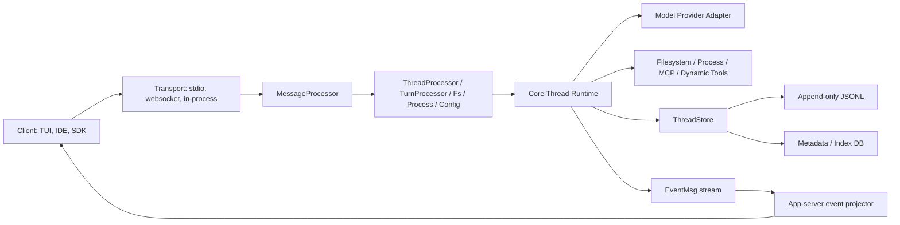
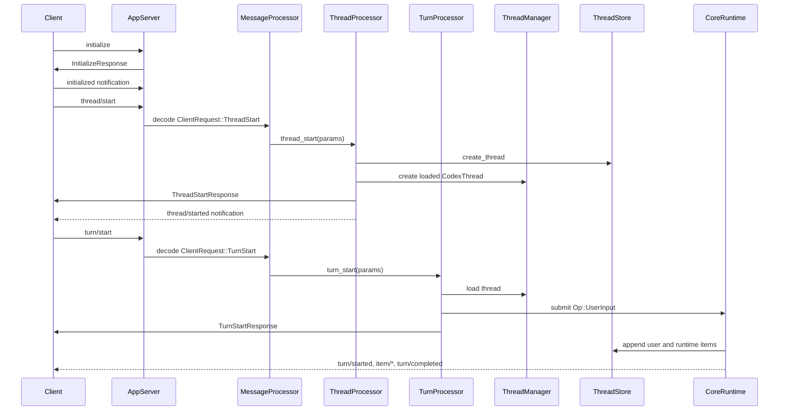

# Build-From-Scratch Blueprint

This layer explains how to design and implement a Codex-like local coding agent
runtime from scratch. It is intentionally concrete: each phase names the module
to build, the data models to define, the API methods to expose, the state to
persist, and the source files in this repository that prove the design.

The goal is not to clone every Codex feature on day one. The goal is to build a
small, correct vertical slice first, then extend it along the same architectural
lines Codex uses.

## Source Anchors

Use these files as the implementation reference points:

| Concern | Source anchors |
|---|---|
| CLI process entry and command routing | `codex-rs/cli/src/main.rs` |
| App-server lifecycle and transport loops | `codex-rs/app-server/src/lib.rs` |
| JSON-RPC-like request handling | `codex-rs/app-server/src/message_processor.rs` |
| Request serialization queues | `codex-rs/app-server/src/request_serialization.rs` |
| Outgoing responses and notifications | `codex-rs/app-server/src/outgoing_message.rs` |
| App-server method catalog | `codex-rs/app-server-protocol/src/protocol/common.rs` |
| Thread API payloads | `codex-rs/app-server-protocol/src/protocol/v2/thread.rs` |
| Thread API projection models | `codex-rs/app-server-protocol/src/protocol/v2/thread_data.rs` |
| Turn API payloads | `codex-rs/app-server-protocol/src/protocol/v2/turn.rs` |
| Core command/event protocol | `codex-rs/protocol/src/protocol.rs` |
| Thread/session facade | `codex-rs/core/src/codex_thread.rs` |
| Thread manager/composition root | `codex-rs/core/src/thread_manager.rs` |
| Core operation dispatch | `codex-rs/core/src/session/handlers.rs` |
| Task abstraction for async work | `codex-rs/core/src/tasks/mod.rs` |
| Storage port | `codex-rs/thread-store/src/store.rs` |
| Live thread write-through wrapper | `codex-rs/thread-store/src/live_thread.rs` |
| Local JSONL plus SQLite storage | `codex-rs/thread-store/src/local/mod.rs` |
| Append-only rollout writer | `codex-rs/rollout/src/recorder.rs` |
| Exec-server RPC router | `codex-rs/exec-server/src/rpc.rs` |
| Exec-server method registry | `codex-rs/exec-server/src/server/registry.rs` |
| App-server API docs and example flow | `codex-rs/app-server/README.md` |

## Target System

Build a local coding-agent runtime with these first-class capabilities:

1. Start or resume a conversation thread.
2. Submit user input as a turn.
3. Stream model/tool progress to a client as notifications.
4. Persist canonical thread history.
5. Read/list stored threads.
6. Run filesystem and process operations behind explicit adapters.
7. Later, split execution into a separate exec-server process.
8. Later, add plugins, skills, MCP, remote control, and daemon lifecycle.

Codex implements this as a typed, event-driven, thread-centered system:



## Non-Negotiable Invariants

Implement these invariants before adding advanced features:

1. External requests are decoded into typed internal requests before reaching
   business logic. Codex does this with `ClientRequest` in
   `app-server-protocol/src/protocol/common.rs` and `deserialize_client_request`
   in `app-server/src/message_processor.rs`.

2. Every request that can mutate a thread is scoped to the affected thread.
   Codex records that in `ClientRequestSerializationScope` and queues requests
   through `request_serialization.rs`.

3. A thread is the unit of long-lived runtime state. Codex keeps loaded threads
   in `ThreadManager` and exposes them through `CodexThread`.

4. A turn starts as a command and progresses through events. Codex submits
   `Op::UserInput` in `turn_processor.rs` and emits `EventMsg` variants from
   `protocol/src/protocol.rs`.

5. The direct response is not the whole answer. `turn/start` returns an initial
   `Turn`, while completion arrives later through `turn/started`,
   `item/started`, `item/completed`, and `turn/completed` notifications.

6. Canonical history is append-only. Codex writes replayable `RolloutItem`
   records through `ThreadStore::append_items` and `RolloutRecorder`.

7. Metadata/index storage is a projection, not the source of truth. Codex uses
   rollout JSONL for replay and SQLite/state DBs for listing and metadata.

## Phase 0 - Repository Skeleton

Create a workspace with these modules or crates:

| Module | Responsibility | Codex analog |
|---|---|---|
| `cli` | Parse command line and choose runtime mode | `codex-rs/cli/src/main.rs` |
| `app_protocol` | Request/response/notification payload types | `app-server-protocol` |
| `core_protocol` | Internal `Op` and `EventMsg` enums | `protocol` |
| `core` | Thread runtime, model loop, tool loop | `core` |
| `thread_store` | Storage trait and live-thread wrapper | `thread-store` |
| `rollout` | Append-only JSONL recorder | `rollout` |
| `app_server` | Transport, routing, processors, notifications | `app-server` |
| `exec_server` | Optional separate fs/process RPC service | `exec-server` |
| `api_client` | Model provider adapter | `codex-rs/api-client` and core model code |

Completion criteria:

- The workspace builds.
- The protocol modules do not depend on app-server internals.
- `core` does not depend on the CLI or TUI.
- Storage is behind a trait, not hard-coded into core.

## Phase 1 - Protocol Envelope

Build the edge protocol before the runtime.

### Types To Define

```rust
type RequestId = u64;
type ThreadId = String;
type TurnId = String;
type ItemId = String;

struct RequestEnvelope {
    id: RequestId,
    method: String,
    params: serde_json::Value,
}

struct ResponseEnvelope {
    id: RequestId,
    result: serde_json::Value,
}

struct ErrorEnvelope {
    id: Option<RequestId>,
    error: RpcError,
}

struct NotificationEnvelope {
    method: String,
    params: serde_json::Value,
}
```

Codex calls this JSON-RPC-like, but `app-server-protocol/src/rpc.rs` notes that
it is not strict JSON-RPC 2.0 because the `"jsonrpc": "2.0"` field is absent.

### Typed Request Enum

Define a typed enum equivalent to Codex's `ClientRequest` macro output in
`app-server-protocol/src/protocol/common.rs`:

```rust
enum ClientRequest {
    Initialize { id: RequestId, params: InitializeParams },
    ThreadStart { id: RequestId, params: ThreadStartParams },
    ThreadRead { id: RequestId, params: ThreadReadParams },
    ThreadList { id: RequestId, params: ThreadListParams },
    TurnStart { id: RequestId, params: TurnStartParams },
    TurnInterrupt { id: RequestId, params: TurnInterruptParams },
}
```

Implement:

- `method(&self) -> &'static str`
- `id(&self) -> RequestId`
- `serialization_scope(&self) -> Option<RequestSerializationScope>`
- `deserialize(method, id, params) -> Result<ClientRequest, RpcError>`

Minimum method names:

| Method | Params | Response |
|---|---|---|
| `initialize` | `InitializeParams` | `InitializeResponse` |
| `thread/start` | `ThreadStartParams` | `ThreadStartResponse` |
| `thread/read` | `ThreadReadParams` | `ThreadReadResponse` |
| `thread/list` | `ThreadListParams` | `ThreadListResponse` |
| `turn/start` | `TurnStartParams` | `TurnStartResponse` |
| `turn/interrupt` | `TurnInterruptParams` | `TurnInterruptResponse` |

Codex source proof:

- `common.rs` maps `ThreadStart => "thread/start"`, `ThreadList =>
  "thread/list"`, `ThreadRead => "thread/read"`, and `TurnStart =>
  "turn/start"`.
- `app-server/README.md` documents the handshake and the sequence
  `initialize -> thread/start -> turn/start -> event notifications`.

Completion criteria:

- Unknown methods return a structured method-not-found error.
- Invalid params return a structured invalid-params error.
- The request handler never switches directly on raw strings outside the
  protocol decode layer.

## Phase 2 - Public Data Models

Implement the API projection models clients see.

### Thread Model

Use `app-server-protocol/src/protocol/v2/thread_data.rs` and
`v2/thread.rs` as anchors.

Minimum fields:

```rust
struct Thread {
    id: ThreadId,
    created_at: i64,
    updated_at: i64,
    name: Option<String>,
    cwd: String,
    status: ThreadStatus,
    turns: Vec<Turn>,
}

enum ThreadStatus {
    NotLoaded,
    Running,
    Idle,
    Closed,
}
```

### Turn Model

Use `app-server-protocol/src/protocol/v2/turn.rs`.

Minimum fields:

```rust
struct Turn {
    id: TurnId,
    items: Vec<ThreadItem>,
    status: TurnStatus,
    error: Option<TurnError>,
    started_at: Option<i64>,
    completed_at: Option<i64>,
}

enum TurnStatus {
    InProgress,
    Completed,
    Interrupted,
    Failed,
}
```

### Item Model

Start with these item types:

```rust
enum ThreadItem {
    UserMessage(UserMessageItem),
    AgentMessage(AgentMessageItem),
    CommandExecution(CommandExecutionItem),
    FileChange(FileChangeItem),
    Reasoning(ReasoningItem),
}
```

Codex has many more item types, but the app-server README's event section
states the essential item lifecycle: `item/started`, optional deltas, then
`item/completed`.

Completion criteria:

- `turn/start` can return a `Turn` with `status = inProgress` and empty items.
- Later notifications can fill in items without changing the original response.
- Stored `thread/read` can return a thread with full turns when requested.

## Phase 3 - Storage Port And Append-Only History

Implement storage before model calls. This lets you validate request, response,
and UI flows without needing a real agent.

### Storage Trait

Start with a subset of Codex's `ThreadStore` trait from
`thread-store/src/store.rs`:

```rust
trait ThreadStore: Send + Sync {
    fn create_thread(&self, params: CreateThreadParams) -> Future<Result<()>>;
    fn resume_thread(&self, params: ResumeThreadParams) -> Future<Result<()>>;
    fn append_items(&self, params: AppendThreadItemsParams) -> Future<Result<()>>;
    fn flush_thread(&self, thread_id: ThreadId) -> Future<Result<()>>;
    fn load_history(&self, params: LoadThreadHistoryParams) -> Future<Result<StoredThreadHistory>>;
    fn read_thread(&self, params: ReadThreadParams) -> Future<Result<StoredThread>>;
    fn list_threads(&self, params: ListThreadsParams) -> Future<Result<ThreadPage>>;
    fn update_thread_metadata(&self, params: UpdateThreadMetadataParams) -> Future<Result<()>>;
    fn archive_thread(&self, params: ArchiveThreadParams) -> Future<Result<()>>;
    fn delete_thread(&self, params: DeleteThreadParams) -> Future<Result<()>>;
}
```

Codex's full trait also includes `persist_thread`, `shutdown_thread`,
`discard_thread`, `read_thread_by_rollout_path`, `search_threads`,
`list_turns`, `list_items`, `unarchive_thread`, and other management paths.
Do not implement those first unless your minimal product needs them.

### Storage Layout

Use two storage forms:

1. Canonical replay log:
   - Path shape: `threads/<thread_id>/rollout.jsonl`
   - Each line is one `RolloutItem`.
   - This is append-only.

2. Metadata projection:
   - Start with `threads/index.json`.
   - Later replace with SQLite.
   - Contains thread id, name, cwd, created_at, updated_at, archived flag,
     current status, and search/list fields.

Codex source proof:

- `thread-store/src/store.rs` defines `ThreadStore`.
- `thread-store/src/live_thread.rs` wraps store operations and calls
  `append_items`.
- `thread-store/src/local/mod.rs` implements local filesystem plus SQLite.
- `rollout/src/recorder.rs` owns append-only rollout recording.

### Rollout Item Model

Minimum:

```rust
enum RolloutItem {
    SessionStart { thread_id: ThreadId, cwd: String, created_at: i64 },
    TurnStart { turn_id: TurnId, started_at: i64 },
    UserMessage { turn_id: TurnId, item_id: ItemId, content: Vec<UserInput> },
    AgentMessage { turn_id: TurnId, item_id: ItemId, content: String },
    ToolCall { turn_id: TurnId, item_id: ItemId, tool: String, args: JsonValue },
    ToolResult { turn_id: TurnId, item_id: ItemId, output: String, success: bool },
    TurnComplete { turn_id: TurnId, completed_at: i64, status: TurnStatus },
}
```

Completion criteria:

- Create thread writes `SessionStart`.
- Start turn appends `TurnStart` and `UserMessage`.
- Complete turn appends `AgentMessage` and `TurnComplete`.
- `thread/read` reconstructs `Thread -> Turn -> ThreadItem` from JSONL.
- `thread/list` reads metadata projection, not every full JSONL file.

## Phase 4 - Core Command/Event Runtime

Now build the internal runtime.

### Core Protocol

Use `codex-rs/protocol/src/protocol.rs` as the model.

Minimum internal commands:

```rust
enum Op {
    UserInput {
        items: Vec<UserInput>,
        thread_settings: ThreadSettingsOverrides,
        final_output_json_schema: Option<JsonValue>,
    },
    Interrupt,
    Shutdown,
}
```

Minimum internal events:

```rust
enum EventMsg {
    TurnStarted(TurnStartedEvent),
    UserMessage(UserMessageEvent),
    AgentMessageDelta(AgentMessageDeltaEvent),
    AgentMessage(AgentMessageEvent),
    ToolCallStarted(ToolCallStartedEvent),
    ToolCallCompleted(ToolCallCompletedEvent),
    TurnComplete(TurnCompleteEvent),
    Error(ErrorEvent),
}
```

Codex source proof:

- `protocol.rs` defines `Op` near `pub enum Op`.
- `protocol.rs` defines `EventMsg` near `pub enum EventMsg`, including
  `TurnStarted`, `TurnComplete`, `AgentMessage`, `UserMessage`, and delta
  events.
- `core/src/session/handlers.rs` has `submission_loop`, which matches `Op`
  variants and dispatches runtime behavior.

### Thread Runtime

Create:

```rust
struct ThreadManager {
    threads: HashMap<ThreadId, Arc<CodexThread>>,
    store: Arc<dyn ThreadStore>,
    model_provider: Arc<dyn ModelProvider>,
    tool_runtime: Arc<ToolRuntime>,
}

struct CodexThread {
    id: ThreadId,
    op_tx: mpsc::Sender<Op>,
    event_rx: broadcast::Receiver<EventMsg>,
    live_thread: LiveThread,
}
```

Codex source proof:

- `core/src/thread_manager.rs` owns loaded threads and shared services.
- `core/src/codex_thread.rs` exposes a facade with `submit(&self, op: Op)`.
- `core/src/tasks/mod.rs` defines `SessionTask` as a task abstraction for
  async work inside a session.

Completion criteria:

- `ThreadManager::create_thread` creates storage, starts a runtime task, and
  returns a `CodexThread`.
- `CodexThread::submit(Op::UserInput)` returns a generated `TurnId`.
- The runtime emits `TurnStarted`, item events, and `TurnComplete`.
- The runtime appends canonical items to `ThreadStore` as events become
  authoritative.

## Phase 5 - App-Server Transport And Router

Build the app-server only after protocol, storage, and core exist.

### Transport Model

Start with stdio or in-process channels. Later add websocket.

```rust
enum TransportEvent {
    ConnectionOpened { connection_id: ConnectionId, sender: OutboundSink },
    ConnectionClosed { connection_id: ConnectionId },
    IncomingMessage { connection_id: ConnectionId, message: IncomingMessage },
}

enum OutgoingEnvelope {
    ToConnection { connection_id: ConnectionId, message: OutgoingMessage },
    Broadcast { message: OutgoingMessage },
}
```

Codex source proof:

- `app-server/src/lib.rs` creates bounded channels for `TransportEvent` and
  `OutgoingEnvelope`.
- `app-server/src/lib.rs` runs a processor loop and an outbound loop.
- `app-server/src/outgoing_message.rs` defines `OutgoingEnvelope`.

### Message Processor

Implement this pipeline:

```text
raw JSON
  -> RequestEnvelope
  -> ClientRequest
  -> initialized/capability checks
  -> request serialization queue
  -> domain processor
  -> ResponseEnvelope or ErrorEnvelope
```

Codex source proof:

- `message_processor.rs::process_request` receives the request envelope.
- `deserialize_client_request` converts it to `ClientRequest`.
- `handle_initialized_client_request` dispatches to domain processors.
- `OutgoingMessageSender` sends direct responses, errors, server
  notifications, and server-to-client requests.

### Initialization Gate

Require:

1. Client sends `initialize`.
2. Server returns `InitializeResponse`.
3. Client sends `initialized` notification.
4. All non-initialize requests before the gate return `Not initialized`.

Codex source proof:

- `app-server/README.md` says clients must send one `initialize` request per
  connection and then emit `initialized`.
- `message_processor.rs` enforces initialization and experimental gating before
  dispatching ordinary requests.

Completion criteria:

- Two app-server loops run concurrently:
  - inbound processor loop
  - outbound router loop
- `thread/start` and `turn/start` can be invoked over the transport.
- Responses preserve request ids.
- Notifications have methods but no request ids.
- Bounded channels apply backpressure instead of unbounded memory growth.

## Phase 6 - Thread And Turn Domain Processors

Now implement the two core product flows.

### `thread/start`

Codex source anchors:

- Method: `ThreadStart => "thread/start"` in `common.rs`.
- Payload: `ThreadStartParams` and `ThreadStartResponse` in `v2/thread.rs`.
- Handler: `ThreadProcessor::thread_start` and `thread_start_inner` in
  `app-server/src/request_processors/thread_processor.rs`.

Implementation steps:

1. Validate `ThreadStartParams`.
2. Resolve cwd and settings.
3. Generate a new `ThreadId`.
4. Call `ThreadStore::create_thread`.
5. Start a core runtime task through `ThreadManager`.
6. Add the thread to the loaded-thread map.
7. Return `ThreadStartResponse { thread, model, model_provider, cwd, ... }`.
8. Send `thread/started` notification.

Minimum request:

```json
{
  "id": 1,
  "method": "thread/start",
  "params": {
    "cwd": "/repo",
    "model": "example-model"
  }
}
```

Minimum response:

```json
{
  "id": 1,
  "result": {
    "thread": {
      "id": "thr_1",
      "createdAt": 1783123200,
      "updatedAt": 1783123200,
      "cwd": "/repo",
      "status": "idle",
      "turns": []
    },
    "model": "example-model",
    "modelProvider": "example",
    "cwd": "/repo"
  }
}
```

### `turn/start`

Codex source anchors:

- Method: `TurnStart => "turn/start"` in `common.rs`.
- Payload: `TurnStartParams` and `TurnStartResponse` in `v2/turn.rs`.
- Handler: `turn_start_inner` in `app-server/src/request_processors/turn_processor.rs`.
- Core command: `Op::UserInput` in `protocol/src/protocol.rs`.

Implementation steps:

1. Load the target thread from `ThreadManager`.
2. Validate input size.
3. Map API `UserInput` into core input items.
4. Resolve cwd/settings overrides.
5. Build `Op::UserInput`.
6. Submit the op to `CodexThread`.
7. Record request id -> turn id for later correlation.
8. Return `TurnStartResponse` with an in-progress `Turn`.
9. Stream notifications as the runtime progresses.

Minimum request:

```json
{
  "id": 2,
  "method": "turn/start",
  "params": {
    "threadId": "thr_1",
    "input": [{ "type": "text", "text": "Explain this repository" }]
  }
}
```

Minimum direct response:

```json
{
  "id": 2,
  "result": {
    "turn": {
      "id": "turn_1",
      "items": [],
      "status": "inProgress",
      "error": null,
      "startedAt": null,
      "completedAt": null
    }
  }
}
```

Minimum notification sequence:

```json
{ "method": "turn/started", "params": { "threadId": "thr_1", "turn": { "id": "turn_1", "status": "inProgress", "items": [] } } }
{ "method": "item/started", "params": { "threadId": "thr_1", "turnId": "turn_1", "item": { "id": "item_1", "type": "userMessage", "content": [{ "type": "text", "text": "Explain this repository" }] } } }
{ "method": "item/completed", "params": { "threadId": "thr_1", "turnId": "turn_1", "item": { "id": "item_1", "type": "userMessage", "content": [{ "type": "text", "text": "Explain this repository" }] } } }
{ "method": "item/started", "params": { "threadId": "thr_1", "turnId": "turn_1", "item": { "id": "item_2", "type": "agentMessage", "content": "" } } }
{ "method": "item/agentMessage/delta", "params": { "threadId": "thr_1", "turnId": "turn_1", "itemId": "item_2", "delta": "This repo..." } }
{ "method": "item/completed", "params": { "threadId": "thr_1", "turnId": "turn_1", "item": { "id": "item_2", "type": "agentMessage", "content": "This repo..." } } }
{ "method": "turn/completed", "params": { "threadId": "thr_1", "turn": { "id": "turn_1", "status": "completed", "items": [] } } }
```

Completion criteria:

- `turn/start` returns before model work completes.
- The UI can render progress only from notifications.
- A reconnecting client can recover final state through `thread/read`.

## Phase 7 - Request Serialization

Add resource-aware request serialization after basic flows work.

Codex source proof:

- `request_serialization.rs` defines queue keys such as `Thread`,
  `ThreadPath`, command-exec process, process handle, filesystem watch, fuzzy
  search, and MCP OAuth.
- `common.rs` assigns scopes, for example `turn/start` is scoped by thread id.

Minimum model:

```rust
enum RequestSerializationQueueKey {
    Global,
    Thread(ThreadId),
    Process { connection_id: ConnectionId, process_handle: String },
}

enum RequestSerializationAccess {
    Exclusive,
    SharedRead,
}

struct RequestSerializationScope {
    key: RequestSerializationQueueKey,
    access: RequestSerializationAccess,
}
```

Rules:

1. Exclusive requests run one at a time per key.
2. Shared reads with the same key may run together.
3. Different keys may run concurrently.
4. A queued exclusive request blocks later shared reads for the same key.

Scope examples:

| Request | Scope |
|---|---|
| `initialize` | none |
| `thread/start` | none or new thread path/global creation lock |
| `thread/read` | shared read on thread id |
| `thread/list` | shared read on global thread index |
| `turn/start` | exclusive on thread id |
| `turn/interrupt` | exclusive on thread id |
| `thread/name/set` | exclusive on thread id |

Completion criteria:

- Two `turn/start` calls for the same thread cannot race.
- A `thread/read` cannot observe half-applied mutation for that same thread.
- Reads for unrelated threads still run concurrently.

## Phase 8 - Model Provider Adapter

Add the actual agent loop only after request/storage/routing are stable.

### Adapter Interface

```rust
trait ModelProvider: Send + Sync {
    fn stream_response(
        &self,
        request: ModelRequest,
    ) -> impl Future<Output = Result<ModelResponseStream>> + Send;
}
```

### Model Request

Build model context from:

1. Stored thread history.
2. Current user input.
3. System/developer instructions.
4. Tool schemas.
5. Bounded additional context.

Do not let arbitrary unbounded data enter the model context. The AGENTS
instructions for this repository call out the same principle: context must be
incremental, bounded, and should avoid unnecessary cache misses.

### Runtime Loop

For a first implementation:

1. Convert `Op::UserInput` into a model request.
2. Stream assistant text deltas.
3. Accumulate final assistant message.
4. Append final `AgentMessage` rollout item.
5. Emit `TurnComplete`.

Later:

1. Parse tool calls.
2. Execute tool calls through `ToolRuntime`.
3. Append tool call/result items.
4. Send tool results back to model.
5. Continue until final assistant response.

Completion criteria:

- Fake provider test can produce deterministic streamed text.
- Real provider adapter can be swapped in without changing app-server handlers.
- Tool execution is not embedded directly in the model adapter.

## Phase 9 - Filesystem And Process Tools

Add local utility tools next.

Minimum filesystem API:

| Method | Params | Response |
|---|---|---|
| `fs/readTextFile` | path | contents |
| `fs/writeTextFile` | path, contents | empty |
| `fs/listDirectory` | path | entries |

Minimum process API:

| Method | Params | Response/Notification |
|---|---|---|
| `command/exec` | command, cwd | result with stdout/stderr/status |
| `process/spawn` | argv, cwd | process handle |
| `process/read` | handle | output chunk |
| `process/write` | handle, bytes | empty |
| `process/terminate` | handle | empty |
| `process/exited` | notification | exit status |

Codex source proof:

- `app-server/README.md` documents filesystem, command, and process APIs.
- `app-server-protocol/src/protocol/v2/fs.rs`,
  `v2/command_exec.rs`, and `v2/process.rs` contain payload types.
- `exec-server/src/server/registry.rs` registers remote filesystem and process
  methods.

Completion criteria:

- Tool calls are mediated by one runtime adapter.
- Process handles are connection-scoped when exposed through app-server.
- Process completion is a notification, not only a response.

## Phase 10 - Approval And Sandboxing

Do this before letting the agent write files or run commands automatically.

Minimum approval model:

```rust
enum ApprovalPolicy {
    Never,
    OnRequest,
    OnFailure,
    Untrusted,
}

enum ApprovalDecision {
    Accept,
    AcceptForSession,
    Decline,
    Cancel,
}
```

Request flow:

1. Core decides a command or patch needs approval.
2. App-server emits server-to-client request
   `item/commandExecution/requestApproval` or file-change approval equivalent.
3. Client responds with decision.
4. Core resumes, declines, or cancels.
5. App-server emits final `item/completed`.

Codex source proof:

- `app-server/README.md` documents command and file-change approval request
  flows.
- `outgoing_message.rs` stores pending server-to-client callbacks.
- `protocol/common.rs` includes server request methods for approvals.

Completion criteria:

- No command runs without policy evaluation.
- Approval request and response are correlated.
- Declined actions produce completed items with declined/failed status.

## Phase 11 - Exec-Server Split

Only add exec-server after local filesystem/process tools work.

Why split:

1. App-server may run on the user's desktop.
2. Execution may need to happen in a remote environment.
3. The execution host may have a different OS from the app-server host.

Codex source proof:

- `exec-server/src/rpc.rs` defines a `RpcRouter`.
- `exec-server/src/server/registry.rs` registers methods like
  `process/start`, `process/read`, `process/write`, `process/terminate`,
  `fs/read`, `fs/write`, `fs/readDirectory`, and `fs/getMetadata`.
- `exec-server-protocol/src/protocol.rs` defines the payloads.

Implementation:

1. Define exec-server JSON-RPC envelopes.
2. Build `RpcRouter` with method -> handler maps.
3. Register filesystem methods.
4. Register process methods.
5. In app-server/core, replace local tool adapter with remote exec adapter when
   an environment selects it.

Completion criteria:

- The same tool call can execute locally or remotely through the same adapter
  interface.
- App-server does not assume remote paths use the app-server OS path syntax.
- Errors include method, request id, and remote execution context.

## Phase 12 - Daemon And Remote Control

Add daemon lifecycle only after the app-server is stable.

Codex source proof:

- `cli/src/main.rs` dispatches `codex app-server daemon`.
- `app-server-daemon` owns detached process lifecycle, pid/lock/settings files,
  and daemon state.
- `app-server/README.md` documents remote-control status notifications.

Implementation:

1. Add `app-server daemon start`.
2. Write pidfile and lockfile.
3. Start app-server detached with configured listen address.
4. Add `status`, `stop`, and `restart`.
5. Add remote-control status state and notifications.

Completion criteria:

- App-server can be started once and reused by rich clients.
- Stale pidfiles are detected.
- Status reflects disabled, connecting, connected, and errored states.

## Phase 13 - Plugins, Skills, MCP, And Apps

Add extension systems last.

Codex has several extension boundaries:

| Extension | Purpose | Source area |
|---|---|---|
| Skills | Read structured instruction bundles | `codex-rs/skills` |
| Plugins | Package skills/MCP/apps/marketplace metadata | `codex-rs/app-server/src/request_processors/plugin_processor.rs` and related crates |
| MCP | External tool/resource protocol | `codex-rs/codex-mcp` and app-server MCP processors |
| Apps/connectors | Discover external app integrations | app-server app request processors |
| Dynamic tools | Client-provided tools per thread/turn | app-server README dynamic tool section |

Implementation order:

1. Static skills directory.
2. Skill listing and skill read APIs.
3. Plugin manifest parser.
4. Plugin install/uninstall/list APIs.
5. MCP client manager.
6. MCP tool list and tool call bridge.
7. Dynamic client tools.

Completion criteria:

- Extension metadata is separate from canonical thread history.
- Tool calls still pass through the same event and approval lifecycle.
- Extension errors are surfaced as item completions or structured RPC errors.

## Minimal Vertical Slice

If starting from nothing, implement this exact path first:



The first working demo should support:

1. `initialize`
2. `thread/start`
3. `turn/start`
4. `thread/read`
5. `thread/list`
6. A fake model provider that streams deterministic text
7. JSONL persistence
8. Notification stream

Do not start with plugins, MCP, daemon, remote execution, cloud tasks, or
review mode. Those are extensions of the core pattern, not prerequisites.

## Exact Implementation Order

Follow this order:

| Order | Build | Why |
|---:|---|---|
| 1 | Protocol envelope and typed request enum | Prevents raw JSON from leaking everywhere |
| 2 | Public Thread/Turn/Item models | Defines what clients render |
| 3 | In-memory `ThreadStore` | Lets handlers work before file persistence |
| 4 | JSONL rollout store | Makes history replayable |
| 5 | `ThreadManager` and `CodexThread` facade | Establishes runtime ownership |
| 6 | Fake core runtime that echoes input | Tests turn flow without model complexity |
| 7 | App-server transport loops | Adds real request/response behavior |
| 8 | `thread/start` handler | First lifecycle route |
| 9 | `turn/start` handler | First async event route |
| 10 | Event projector to notifications | Makes UI streaming possible |
| 11 | `thread/read` and `thread/list` | Makes persisted state visible |
| 12 | Request serialization queues | Removes race conditions |
| 13 | Real model provider adapter | Adds intelligence behind stable contracts |
| 14 | Filesystem/process tools | Enables coding work |
| 15 | Approval flow | Makes side effects governable |
| 16 | SQLite metadata projection | Makes history UI fast |
| 17 | Exec-server | Separates execution host from app-server host |
| 18 | Daemon | Keeps app-server alive for rich clients |
| 19 | Skills/plugins/MCP | Adds extension ecosystem |

## Beginner-Friendly Test Plan

Add tests in the same order as implementation.

| Phase | Test |
|---|---|
| Protocol | Raw JSON for each method decodes into the expected typed request |
| Protocol | Unknown method returns method-not-found |
| Storage | Appending JSONL and replaying reconstructs the same thread |
| Storage | Metadata update affects `thread/list` without rewriting history |
| Core | Fake provider emits TurnStarted, AgentMessage, TurnComplete |
| App-server | `initialize` required before ordinary requests |
| App-server | `thread/start` response id matches request id |
| App-server | `turn/start` returns immediately and completion arrives as notification |
| Routing | Two same-thread mutations run serially |
| Routing | Two different-thread reads run concurrently |
| Tools | Command approval decline prevents execution |
| Recovery | Restart server and `thread/read` returns previous completed turn |

Codex repository guidance for app-server tests says to exercise the public
JSON-RPC API. Use that same strategy in a from-scratch system: test public
requests and notifications before testing private helper functions.

## Common Failure Modes

Avoid these mistakes:

1. Returning the final assistant answer directly from `turn/start`.
   Correct design: `turn/start` returns the turn id; notifications stream
   progress and completion.

2. Treating SQL rows as canonical history.
   Correct design: append-only history is canonical; indexes are projections.

3. Letting handlers mutate shared thread state without serialization.
   Correct design: scope each request to a resource key.

4. Putting model-provider details into app-server handlers.
   Correct design: handlers submit `Op` values to core.

5. Running shell commands directly from model parsing code.
   Correct design: tool calls go through a tool runtime, policy checks, and
   approval flow.

6. Making plugins/MCP part of the first design.
   Correct design: build a stable core first, then add extension adapters.

7. Losing request ids after dispatch.
   Correct design: preserve request id for direct responses and maintain
   separate event ids/item ids/turn ids for streamed work.

8. Keeping only live state.
   Correct design: every completed turn must be recoverable after process
   restart.

## Definition Of Done For A Reimplementation

A beginner implementation is structurally sound when all of these are true:

1. You can start the app-server.
2. A client can initialize a connection.
3. A client can create a thread.
4. A client can start a turn.
5. The turn returns immediately with `status = inProgress`.
6. The client receives `turn/started`.
7. The client receives item start/delta/completed notifications.
8. The client receives `turn/completed`.
9. The canonical JSONL history contains the thread start, user message,
   assistant message, and turn completion.
10. Restarting the server and calling `thread/read` reconstructs the thread.
11. Calling `thread/list` returns metadata without replaying every item.
12. Same-thread mutations are serialized.
13. Filesystem/process side effects go through adapters.
14. Side effects can be approved or declined before execution.
15. The core runtime can swap fake and real model providers without changing
   app-server request handlers.

That is the smallest honest version of this system. Everything else in Codex is
an extension of those foundations.
