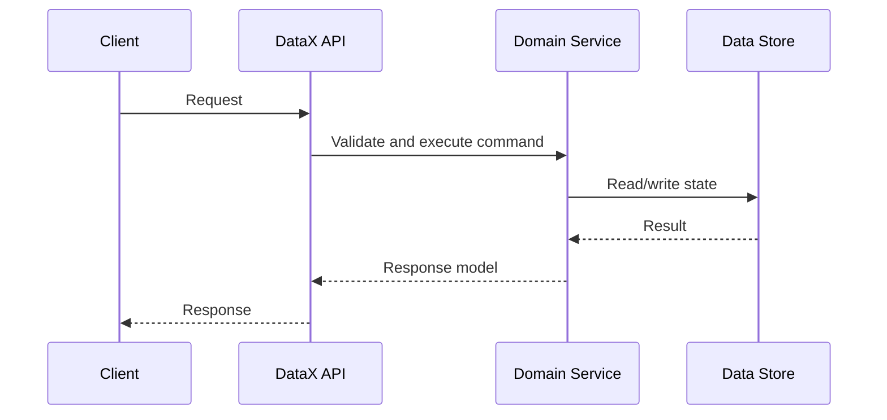

# APIs and Contracts

## Purpose

Catalog public APIs, internal service contracts, event schemas, and data
exchange formats.

## Contract Inventory

| Contract | Type | Producer | Consumer | Versioning |
|---|---|---|---|---|
| TBD | REST / event / file / RPC | TBD | TBD | TBD |

## API Shape

## Compatibility Rules

- TBD

## Error Model

- TBD
