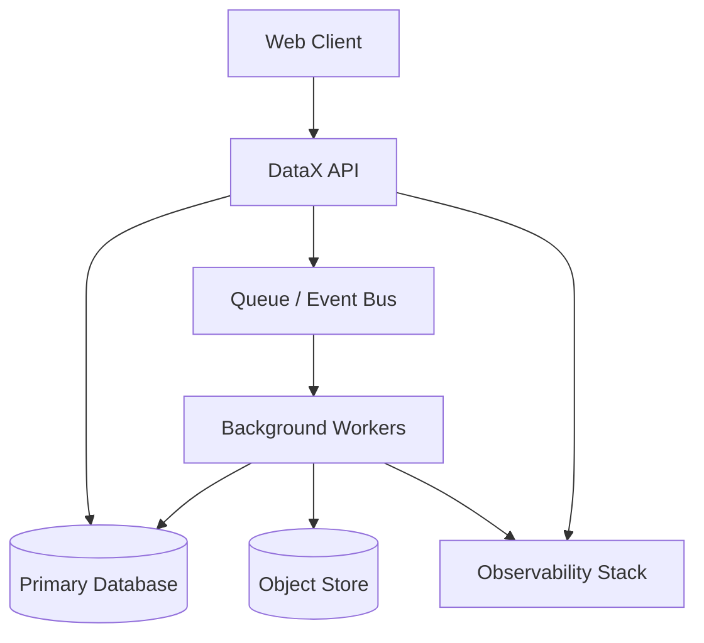

# Container Architecture

## Purpose

Capture the deployable/runtime containers that make up DataX and the contracts
between them.

## Container Diagram

## Containers

| Container | Responsibility | Runtime | Owner |
|---|---|---|---|
| Web Client | TBD | TBD | TBD |
| DataX API | TBD | TBD | TBD |
| Background Workers | TBD | TBD | TBD |
| Queue / Event Bus | TBD | TBD | TBD |
| Primary Database | TBD | TBD | TBD |
| Object Store | TBD | TBD | TBD |

## Key Contracts

- TBD

## Design Notes

- TBD
