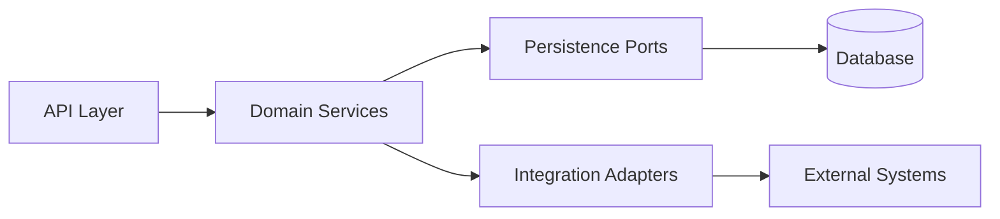

# Core Components

## Purpose

Break each container into major logical components and explain the
responsibilities, boundaries, and dependencies.

## Component Inventory

| Component | Container | Responsibility | Dependencies |
|---|---|---|---|
| TBD | TBD | TBD | TBD |

## Component Diagram

## Ownership Rules

- Components should expose narrow interfaces.
- Domain logic should not depend directly on transport or storage details.
- Integration behavior should be explicit enough to test at the boundary.
