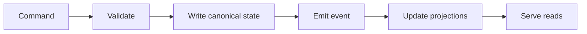

# Storage and State

## Purpose

Describe canonical state, derived projections, retention, consistency, and
ownership boundaries.

## State Inventory

| Store | Data Owned | Consistency | Retention | Notes |
|---|---|---|---|---|
| Primary Database | TBD | TBD | TBD | TBD |
| Object Store | TBD | TBD | TBD | TBD |
| Cache | TBD | TBD | TBD | TBD |

## State Flow

## Invariants

- TBD

## Backup and Recovery

- TBD
