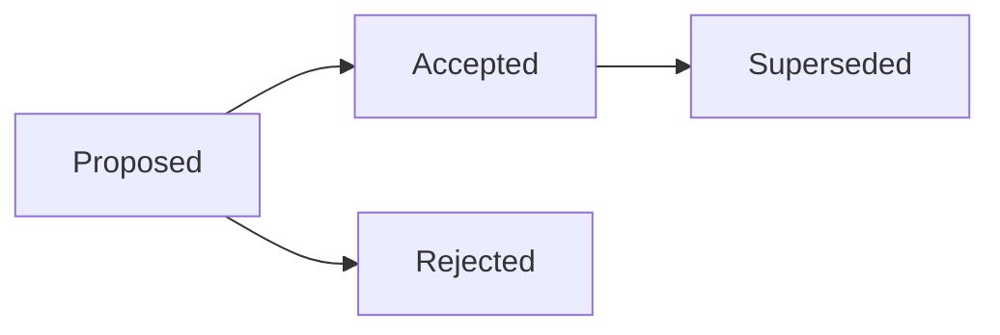

# Architecture Decision Records

Use ADRs to preserve the reasoning behind significant design choices.

## Decisions

| ADR | Title | Status |
|---|---|---|
| [0001](adr-0001-record-architecture-decisions.md) | Record architecture decisions | Accepted |

## Lifecycle

