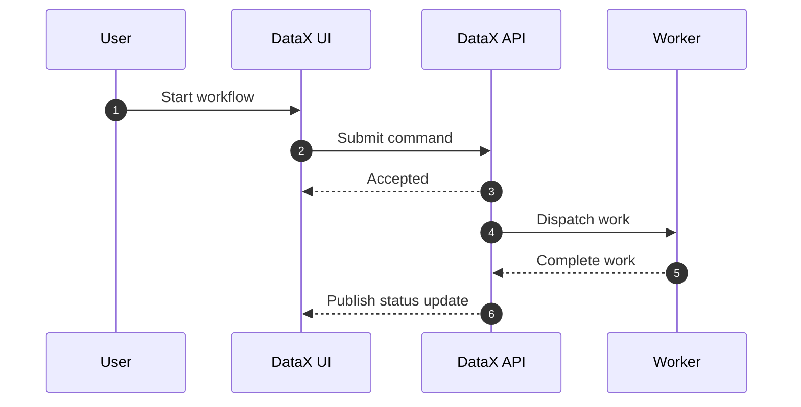

# Core Workflows

## Purpose

Capture the most important product and system workflows as sequence diagrams.

## Workflow Inventory

| Workflow | Trigger | Outcome | Status |
|---|---|---|---|
| TBD | TBD | TBD | Draft |

## Example Sequence

## Failure Paths

- TBD
