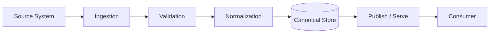

# Data Flows

## Purpose

Document how data enters, moves through, transforms inside, and exits DataX.

## Flow Inventory

| Flow | Source | Transformation | Destination | Owner |
|---|---|---|---|---|
| TBD | TBD | TBD | TBD | TBD |

## Example Data Flow

## Data Quality Rules

- TBD

## Lineage

- TBD
