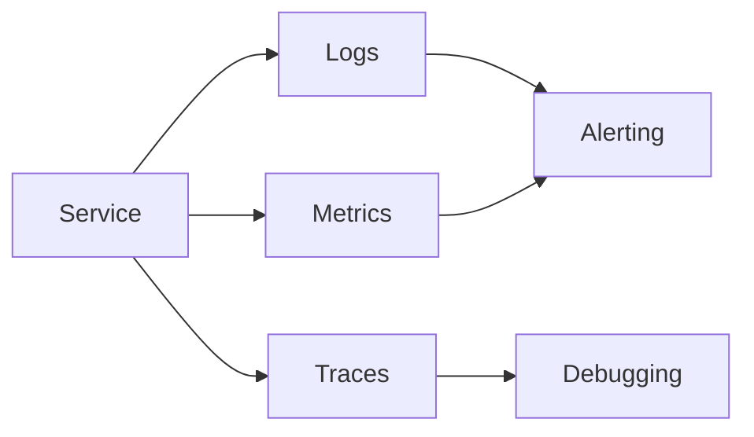

# Operational Model

## Purpose

Define how DataX is deployed, monitored, supported, and recovered.

## Runtime Environments

| Environment | Purpose | Deployment Model | Notes |
|---|---|---|---|
| Local | Development | TBD | TBD |
| Staging | Validation | TBD | TBD |
| Production | Customer-facing runtime | TBD | TBD |

## Operational Concerns

- Deployment and rollback
- Configuration and secrets
- Observability
- Incident response
- Backups and restore
- Capacity and scaling

## Health Model

