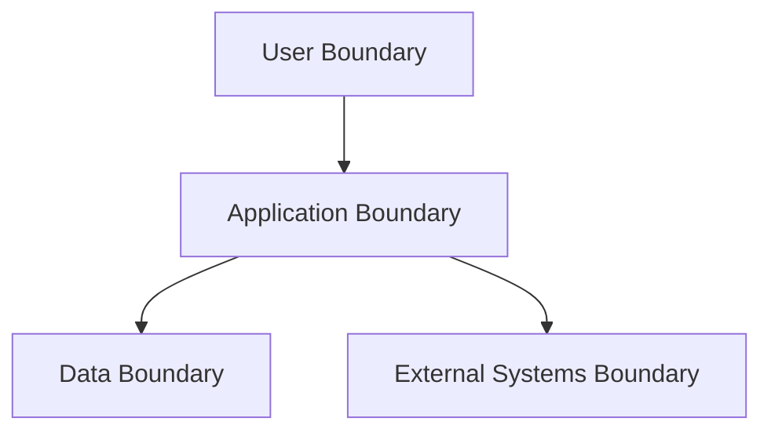

# Security and Governance

## Purpose

Capture trust boundaries, authentication, authorization, data protection,
compliance needs, and governance controls.

## Trust Boundaries

## Controls

| Area | Control | Status | Notes |
|---|---|---|---|
| Authentication | TBD | TBD | TBD |
| Authorization | TBD | TBD | TBD |
| Secrets | TBD | TBD | TBD |
| Audit | TBD | TBD | TBD |
| Data retention | TBD | TBD | TBD |

## Open Questions

- What data classification model applies to DataX?
- Which actions require audit trails?
- Which integrations cross a security boundary?
