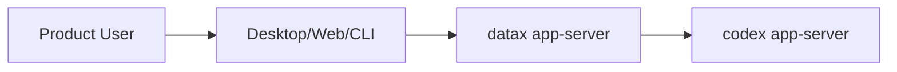

# Platform

## Purpose

datax is an app-server which allows developers to build rich UI clients to Plan, Build, Deploy, Schedule, Execute and Monitor the Data Engineering tasks. It has a first-class integration with codex app-server.

## Actors

| Actor | Goal | Notes |
|---|---|---|
| Product user | TBD | Primary human user of DataX |
| Platform Owner | TBD | Owns System Design and steering the development work. |
| Codex | TBD | Builds and maintains the platform |
| External system | TBD | Integrates with codex app-server |

## Platform Context

## Platform Boundary

datax owns:

- Product Features required for managing the Data Engineering landscape.
    - Planning, Building, Deployment and Monitoring Data Engineering requirements.
    - Plugins support for Data Engineering Tools.
    - Worktrees to keep parallel task changes isolated with built-in Git worktree support.
    - Git worktree Support.
    - Automations for scheduling recurring tasks , or wakeup the same thread for ongoing checks.
    - Data Engineering Skills for reusing instructions and workflows in the application.
    - Data Engineering Workflows.
    - Context usage and Compaction.
    - Task Scheduler and Runner support for scheduling and executing tasks.
    - Adapter support for log collection from deployed cloud services.
    - Unified Monitoring support of the DE pipeline.
- App-Server protocol for clients.
- Firs-class datax client integration with codex app-server
    - AgentRuntime or CodexRuntimeAdapter interface.
- Persist DataX domain state separately.
- Codex events as inputs to DataX projections, not as DataX’s entire model.
- Owns the data-engineering product; Codex powers the agentic work inside it.
- Owns the .codex workspace. CLI/Web/Desktop application owns the .datax workspace.

datax integrates with:

- Upstream : Integrates with the client Interface.
- Downstream : Integrates with the codex app-server.

datax does not own:

- Client Interface development and deployment.

datax traps:
- Do not expose Codex Thread/Turn/Item directly in DataX APIs.
    
    That will re-create the coupling you are trying to escape.
- Do not make Codex history the source of truth for DataX.
    
    Codex history is agent interaction history. DataX also needs durable product state: plans, workflows, schedules, deployments, run records, monitors, approvals, artifacts.
- Do not overfit the first DataX model to Codex UI assumptions.
    
    Codex is optimized for software-agent sessions. DataX is a data-engineering control plane with agent support.
- Do not fork too much Codex code too early.
    
    Reuse concepts and crates where practical, but keep a clean boundary so upstream Codex changes do not constantly break DataX.
- “reuse Codex” means DataX is mostly a thin semantic wrapper around Codex Thread/Turn/Item.

## Open Questions

- Which users and systems are in scope for the first release?
- Which integrations are mandatory versus optional?
- Which service owns each data contract?
