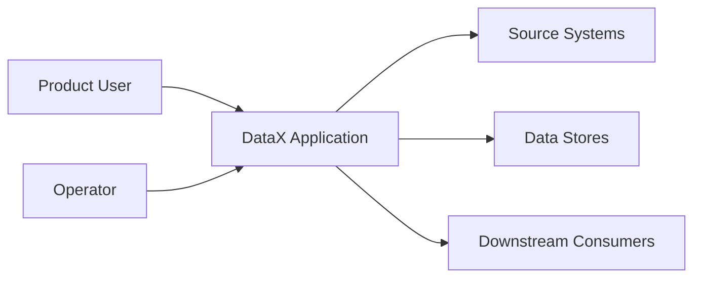

# System Context

## Purpose

Describe what DataX does, who uses it, which systems it touches, and where the
system boundary begins and ends.

## Actors

| Actor | Goal | Notes |
|---|---|---|
| Product user | TBD | Primary human user of DataX |
| Operator | TBD | Owns deployment, monitoring, and recovery |
| Developer | TBD | Builds and maintains the platform |
| External system | TBD | Upstream or downstream dependency |

## Context Diagram

## Boundary

DataX owns:

- TBD

DataX integrates with:

- TBD

DataX does not own:

- TBD

## Open Questions

- Which users and systems are in scope for the first release?
- Which integrations are mandatory versus optional?
- Which service owns each data contract?
