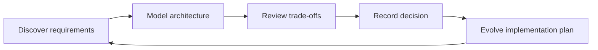

<section class="hero">
  

    
Architecture Knowledge Base

    <h1>DataX Design</h1>
    

      A living design portal for DataX system architecture, request flows,
      container diagrams, operational models, and implementation decisions.
    

    

      <a href="datax/" class="md-button md-button--primary">Explore DataX</a>
      <a href="codex/00-index/" class="md-button">Read Codex Study</a>
    

  

  

    Version-controlled design artifacts
    Mermaid-native diagrams
    Published with GitHub Pages
  

</section>

## Design System Map

### DataX Design

The primary architecture space for DataX. Use this section for system context,
container architecture, workflows, data flows, APIs, storage, security, and
operations.

[Open DataX design](datax/index.md)

### Codex Design Study

Existing design research for Codex. This remains as a reference architecture
study and a source of patterns for extending DataX.

[Open Codex study](codex/00-index.md)

### Templates

Reusable writing patterns for architecture docs, sequence diagrams, flow
charts, container diagrams, API contracts, data models, and ADRs.

[Open templates](artifact-templates/index.md)

## Current Status

  

    <strong>Codex study</strong>
    Documented and wired into the site navigation.
  

  

    <strong>DataX architecture</strong>
    Structured and ready for design artifacts.
  

  

    <strong>Publishing</strong>
    Configured for GitHub Pages from Actions.
  

## Working Agreement

Design artifacts should be text-first, reviewable, and easy to evolve. Prefer
Markdown plus Mermaid for diagrams unless the artifact needs a richer modeling
tool. Every significant architectural decision should graduate into an ADR once
the trade-off is stable enough to preserve.

